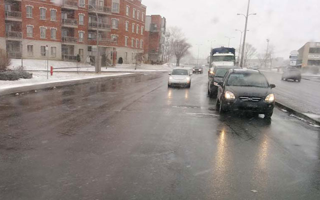

日本と北米の皆さんこんにちは。
最近日本では、車を所有率が下がってるらしいとの記事を読んだ。まぁあんだけ何重にも税金とられりゃ買う気なくなるわな。車検とか単なる税金徴収システムじゃないか。

まぁいいや。

今日は、カナダと日本の車事情の違いについてチョロっとキーボード叩こうかと思います。katakatakatakata

## 1\. 車のナンバープレートは後ろにしかない。

ところで、北米では駐車と言えば路上駐車が一般的。路駐することを前提に街が設計されているのだ。縦列駐車が苦手な人もすぐに慣れるであろう。

これは、僕がカナダに来て最初に気が付いた日本とカナダの違いだ。フロントにナンバープレートが付いてない車がずらっと道路に並んでいる光景は当時随分と違和感を感じたものだ。ナンバープレートはリアにさえ付いていればそれで良いのだ。
僕自身はショッピングモールで警備員をやっていた当時、フロントにナンバープレートが無いおかげで当て逃げ車両の特定が難しく、結構困った。広大なカナダの駐車場では監視カメラぐらいしか犯人探しの手段がないのだ。
まぁそれでもナンバープレートは後ろに一枚あればいいよな…。メーカーにとってもフロント周りのデザインに制約が無くなるし。

合理的。

（一部の州では日本と同じようにナンバープレートは前後についてます。）

## 2\. ライトが常時点けっぱなしである。

法律により、車のフロントライトは昼であろうと常時オンである。っていうかライトを点けたり消したりするスイッチがない。エンジンかかれば勝手に点灯。ドライバーに選択の余地はない。
交通事故は日没の頃、薄暮といわれる時間帯に一番多く発生するのは世界共通。一般にはその時間帯がライト点灯を判断するタイミングなのだろうが、目が慣れてしまうと本格的に暗くなるまで忘れがちだ。

このカナダのシステムならそんな心配一切無用。点灯忘れというヒューマンエラーを想定した強引設計。カナダのあらゆるシステムや法律は「人間は本来馬鹿である。」という性悪説にも似た思想に基づいて設計されているのだ。

昼間っからライトつけている姿はちょっと格好悪いし、ライトバルブも間違いなく日本より多く買い換える必要があるだろうが、これにより数パーセントでも事故が減らせるなら社会全体で費用対効果が十分あるといえる。

うーん合理的。

## 3\. 後部ウィンカーがない車がある。

現在新車として流通している車の中にも、後部ウィンカー（方向指示器）が装備されてない車がある。というのも、ブレーキランプがウィンカーとしての 2 つ目の役割をもっている車が結構あるのだ。

通常はブレーキランプとして使われるけど、同時にウィンカーとしても使われますよって車が結構ある。日本やヨーロッパではブレーキランプは赤でウィンカーはオレンジ色として独立してなきゃならないが、ここカナダ（アメリカ含む）では後部ウィンカーなぞ省略されてしまって、ブレーキランプそのものがウィンカーとしても機能する車を結構見かける。運転を始めた当初はちょいと混乱したがすぐ慣れた。

赤くたって点滅してりゃウィンカーに見える。…合理的。

## 4\. 登録が簡素化されている。

過去に個人で車を売ったことがあるのだが、まあ簡単であった。

オンラインで売りたい車の写真とコンディションをさらっと書いて掲載したら、すぐに連絡が来た。車の状態をチェックした買い手である男はなかなか気に入ったらしく、彼自身が持参していた登録変更のためのたった 1 枚の紙を僕に渡した。すぐにこんな展開になると予想していなかった僕はちょっと焦ったが、記入事項も非常に簡素なものであった。ハンコも要らないし。
僕は必要事項をチャッチャと記入、彼に返した。
彼はポケットから現金を取り出し僕に渡すと、たった今彼の所有となった車を運転して家路についた。ついで陸運局に寄ってその書類を渡すそうだ。

それで終わりである。感覚がまるで自転車。うーん合理的。

## 5\. 車検が存在しない。

キタコレ。伝家の宝刀。車検が無い。車の点検は自分たちで責任持ってやるのが筋ってものだ。お上任せにしない。

車検が無いとキケーン！って叫ぶ人を毎年見かけるのだが、車は壊れたらその時点で動かん。走行状態から完全に制動不能に陥るほど運の無い奴はとっくに別の何かで死んでいる。そもそもブレーキペダルが唯一の制動手段ではない。いや待て、そもそもそんなレアな壊れ方は車検程度では防げん。そんな心配する君はファイナルデスティネーションの見過ぎである。

---

つい熱くなってしまった。今回はこの辺で締めよう。

カナダは完全に車社会ってイメージだけど、都市部には公共交通機関がしっかり張り巡らされているから特に必要ないし、ガソリンもしっかり高い。今日現在、モントリールではリッター 1 ドル 17 セント（約 117 円）である。全く安くない。

まあそれでもカナダに遊びに来た際は是非レンタカーを利用して、思いっきり北米地域の自然を楽しんで欲しい。車でなけりゃできない体験もたくさんある。僕は車持ってないけど。

いつか日本車買いたい。過去に買った Ford は見事なゴミであった。

したっけ。
