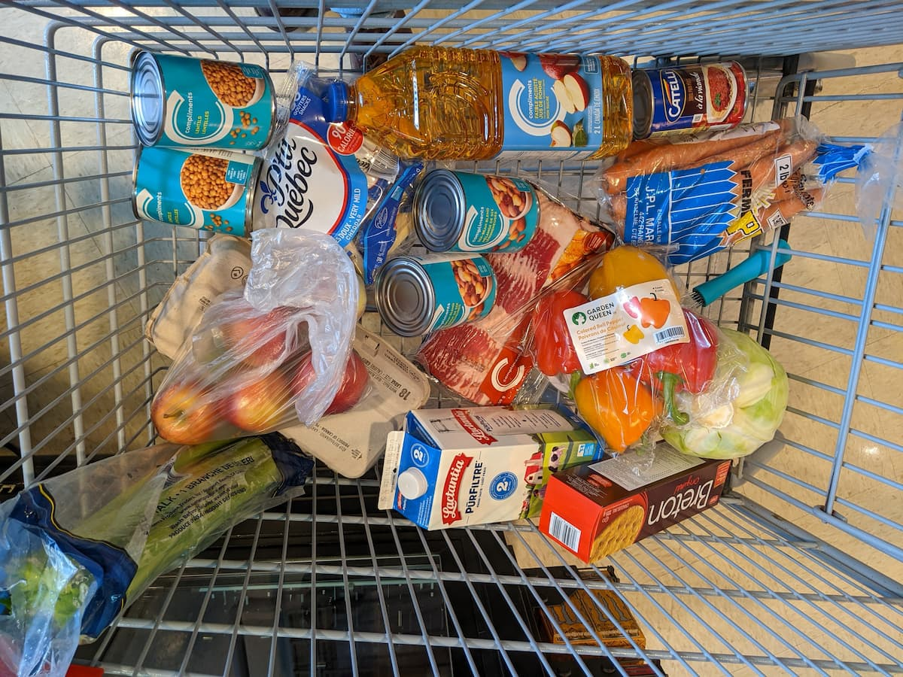

日本と北米の皆さんこんにちは。
この間[車壊れちゃったんで](/blog/car-trouble '車壊れた')、郊外に居住する Kyoshin の生活はしばらく石器時代に戻ります。一応近所にもバスは走ってるんだけど、バスのチケット持ってないからそいつをチャージしに出かけることにする。チケットを買える場所はこの街にも何ヵ所かあるんだけど、薬局が一番近い。

まぁ別にチケット事前購入しなくても小銭もってりゃバス乗れるんだけど、なかなかこういう機会ないし散歩がてら行ってみるわ。

徒歩 42 分。実際 50 分くらいかかるだろな雪上行進だし。

本日の気温はマイナス 11 度と比較的穏やか。無理だと思ったらバスに乗れるようランドリー用に貯めておいた小銭をポッケに忍ばせとく。

## 出発

🥳 パッパラパー

うちの近所。家しかねっす。

🎤「雪〜の進軍氷を踏んでぇ、ど〜こが河や〜ら道さえ知れずぅ〜…」Dorval に響く[雪の進軍](https://youtu.be/aqjX1bQgKa8?t=13)

歩くこと 15 分。おそらく一番近いコンビニらしきもの通過。

ほうほう、ここら辺がコンビニか…。

僕はこの Dorval に引っ越してもうすぐ一年になるけどコンビニに足を運んだことが一度もない。カナダにいるとあんまコンビニ行かないのよ。コンビニの商品は基本割高だし質もあんまり良くない。そもそも日常生活に必要な物はグローサリーストアとかホームセンターで調達するし。カナダではサービス業でない限り仕事は 5 時きっかりに終わるのよ、そんで平日買い物できる。というわけでコンビニ行く機会がない。

単調な線路沿いをひたすら歩く。徒歩って暇ですねぇ。

アンダーパスの入り口。ここから線路及びそれに並走して走る高速道路を横断しまあす。

線路と両側 6 車線ある高速道路を一気に横断するだけあって結構長い。防空壕かな？ 🤔

途中 Tim Hortons を見つけたので買い食い。ペロペロ。😋 うめぇ。

着いた。ここなら薬局に隣接した大きなグローサリーストアもある。

50 分歩いてようやく目的地に到着。バスのチケットを買いに来たけど、今後なくなると困りそうな物もここで買っておこう。

## Jean Coutu（薬局）

ムスコちゃんの誕生日が近いのでバースデーカード 🥳 それと睡眠薬。睡眠薬なしだと一睡もできないの変人なので毎日飲む。

後はグロサリー行って長持ちしそうな食糧を買っておこう。車なしでこんなとこ何度も行ったり来たりできん。気合い入れてくぜ。

## IGA（グロサリー）

おらあ！キャベツ 1 玉。これは$3.96（396 円ってとこ）

来いやあ！18 個入り玉子。$4.98（498 円って感じ）

ほい来た！2 リットルのミルク。いつもは 4 リットルの買うけど徒歩で運ぶこと考えるとさすがに躊躇するわ。

こんくらいにしといてやるか。

手搬送があまりに億劫なので、このくらいに留めておく。消費税含めてトータルで$69.83（6983 円って感じ）。州によって違いはあるけど、ケベック州では消費税は 15％。高！って思うだろうけど、全ての商品にかかるわけじゃなくて、野菜、穀物や肉などの基本的な食材には一切かからないのだよ。今回の買い物をみると 69.83 ドルの内、消費税は 1.05 ドルなんで計算すると たったの 1.5％。貧困層にやさしいよね。日本も見習えばいいのに。

食品でも、お菓子とか加工食品とかの贅沢品にはきちんと消費税かかるはず。

日本も最近物価あがってるらしいね。給与あがる見込みもないし、無差別に他人を攻撃する事件がちらほら聞かれるし、kyoshin が住んでた頃とはだいぶん違う国みたいになってきたな。ひと昔のタイとかフィリピンみたいなとこまで突き抜けた国になって欲しい。

おっと、このへんにしとくか。

したっけ。
