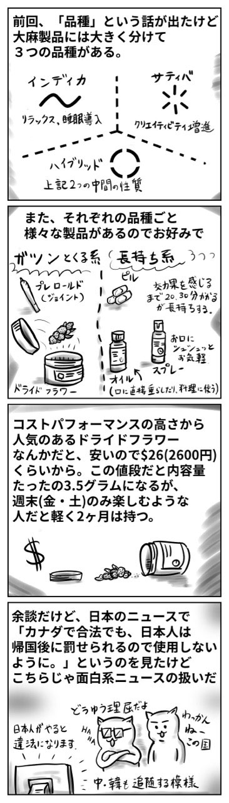

日本の皆さんこんばんは。

なんか平成がもうすぐ終わるらしいね。んで、やっぱ新元号出るのか。

陸自在籍時、文書発行する時何百回も書いたわ「平成 ○○ 年…」って。

陸自はまぁそりゃあ結局お役所だからしょうがないんだけど、全ての文書や資料の日付は元号だったんだよ（たぶん今もそーだろ）

だから面倒臭かったんだよ米軍さんに向けてプレゼンする時とか。なんか気を使ってんのか向こうからコソコソ耳打ちされんだよ。「ねね、日本ってさ…未だに西暦採用してないの？」みたいにさ。こっちも「いや、とっくの昔にしてんだけど、あれはなんていうか、特別？みたいな…」って説明するけど絶対理解してないの。

まぁいいや。

こんかいは前回の記事（[大麻解禁後のカナディアン）](/blog/cannabis '前回の記事')の続きだよ。

## 品種および製品

最後のコマで描いたように「違法になるので注意しましょう。」みたいなことが日本のニュースやモントリオール領事館からのメールで知ったけどさ、もし日本人が合法であるカナダに来て大麻吸ったら、帰国後どういう理由で立件するのかねホント。だって日本国内ですら「使用」に関してはノータッチなんだぜ。

まてよ、もし日本国内に居住しているカナダ人（英会話教師）がいたとして、カナダに帰省した時に吸ったとしたら帰国後逮捕すんのか？しないのか？カナダ人だから？

そんじゃあ、もしそのカナダ人が日本人の友人を連れて行って 2 人で吸って帰ってきたらどうなるの？帰ってきたらその日本人だけ逮捕されるの？理由は日本国民だから？

日本じゃ身分や国籍の違いで違法になったり合法になったりするのが普通なの？尊属殺重罰規定廃止したばっかなのにまたヤラかすのか日本は？

合法である国で合法的に楽しんだのを違法行為として取り扱うなんて大爆笑。ホント笑いのネタが絶えねぇな日本は。

読んでくれてありがとう。

したっけ。
