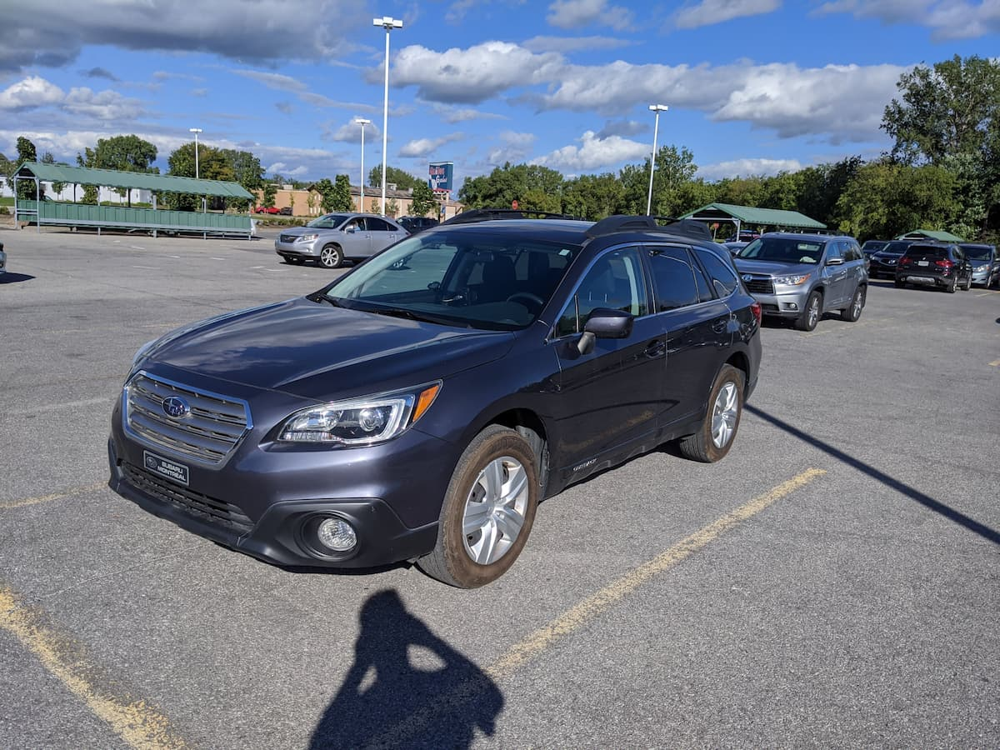
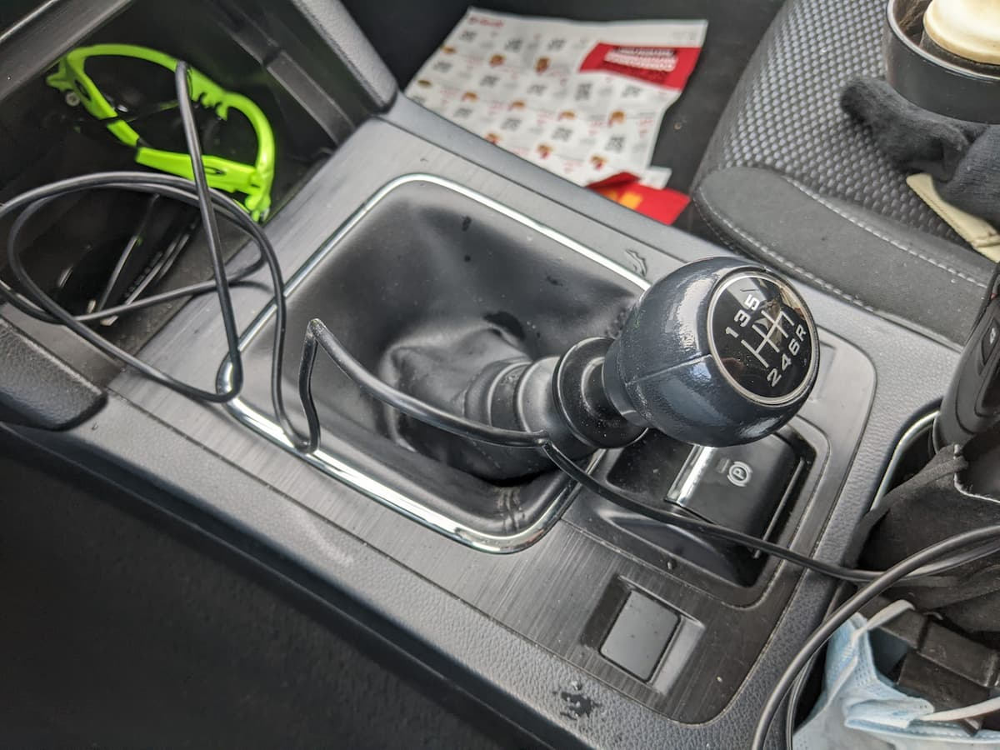
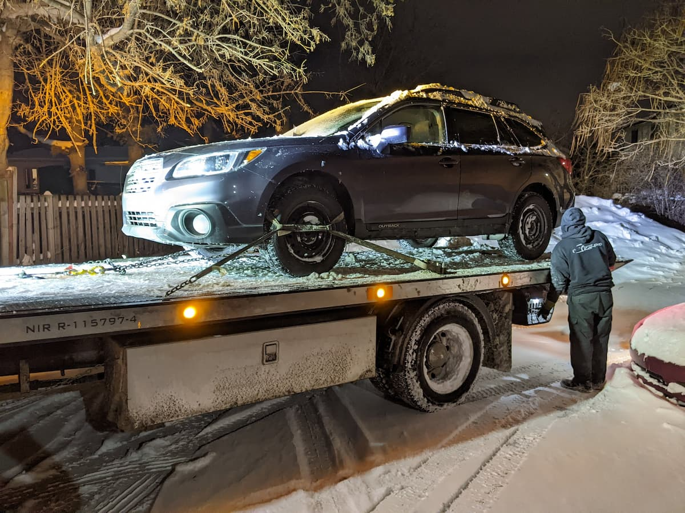
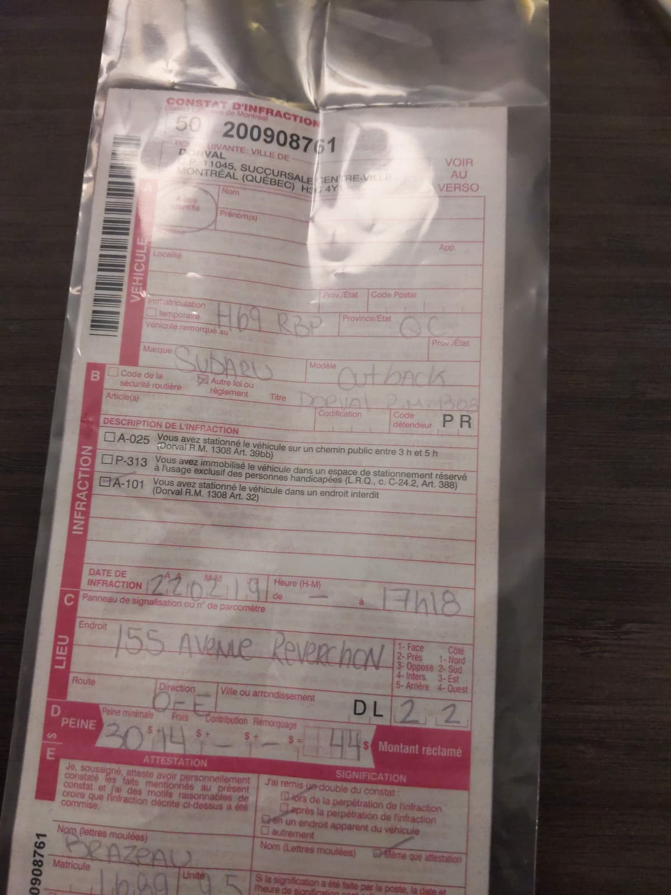

日本と北米の皆さんこんにちは。
いきなりだけど昨日運転中に車壊れた。そう、なんの前触れもなくね。日本車なのに。キィーーー 😠

何が起きたんでしょうかね〜。

## 2 月 19 日（土）

昨日さ、土曜日なんだけど食料品買いに出かけたのよ。Costco に行って一週間分の野菜とかお菓子とか買って、アジア系のスーパーにも寄ってキムチなんか買ってさ、キムチ鍋大量にこしらえて今週はそれで生きようって企んでたのよ。そう、一週間キムチ鍋。（一つの料理で一週間。だって面倒じゃん。）

その日は記録的な豪雪日。もうね、空から道路にかけて真っ白。風も強いから地吹雪起きてんの。視界も悪かったし、幹線道路の信号機も全部赤で点滅させてるし（全方向一時停止）まぁ大変な日だよね。こんな日にわざわざ行かなくても良かったんだけどさぁ…面倒臭いことは基本土曜日に終わらして日曜は何もしないっていうルーティーンにしないと気が済まない頭おかしい人なんで無理して出かけたんだよ。

それに加えて、雪の日は自分の車の四駆性能を引き出して走ることができるから結構好きなんだよガンガン積もってる中ドライブすんの。かなり深いとこでも問題なく走れちゃうんだもん Outback。

Subaru 最高。🥳 マヌアルにして良かったー。

でさ、幹線道路走ってた時に急にシフトノブからなんか変な振動伝わり始めたんだよ。オヨヨと思ってさ、多分 80km/h くらい出てたから右に寄せたんだよ、シフトダウンしながらさ。

6 速から５に落とそうとしたけど、できないんだよ。

### ギア無いんだよ。

そんで ４速に落とそうとしたんけどさ、

### それも無いんだよ。

ああこれ緊急事態だわと思って、もうグワっとブレーキ踏んで 2 速に当ててみたんだよ。

### 2 速はあったんだわ。

ほっこり 😊

って場合じゃないのよ、ここ幹線道路。しかも視界超悪い。ここで停まったら追突されかねんってことでとりあえず２速でグワングワン言わせながら走り続ける。２速さんパネーっす。

ほどなくして適当な小道を見つけ進入、停車。それと同時に頼みの綱だった２速さんも失う。

外は真っ白。オワタ＼(^o^)／

シフトがプランプランしてる。なんの手応えもない。

状況はというと、まぁギアはスッカスカ、シフトが空を切ってる。何も感じねっす。まさか落としたのかと思って車外に出て車体下部を覗き込む。Outback は最低地上高が高いからそりゃもう良く見えましたよ、ええ。

ところが別に何の異常も見られない。むしろ綺麗。てかトランスミッションは走行中にポトりと落ちるような設計になってるはずもない。ちょっと考えれば分かりそうなはずなのにこんな滑稽な動きを披露してしまうなんてこのおじさんは明らかに混乱していたのでしょう。

## レッカーを呼ぶ

幸いきちんと保険には入っているので保険会社に電話してみる。「どーすればいいんでしょー？？」

…

相談の結果、修理の話は一旦置いといてとりあえずレッカー車を手配してもらうことに。問題はどこに下ろすのかなのだが、国民の生活が第一のカナダには週末に営業してるガレージなんて存在しない。自宅アパートの駐車場に下ろしてもらうことに。修理に出す際二度手間になるがもうしょーがない。こんなへんぴなところに車置いてけないし。

ただ問題はレッカーいつ来られるか見通しがたたないこと。当日は稀にみる大雪プラス強風の日、街のあらゆるところで車がスタックしてるのが容易に想像できる。

オペレーター「アナタの車なかなか最悪の日に壊れてくれましたネー。」

あれ、人生最高？

いつ来るかわからないものをいつまでも待ってらんないし、幸いにも現場は自宅アパートからそんなに離れた場所でもなかったんで、車両を残置して徒歩で帰宅することに。実際こういうことは良くあるらしく「鍵をフロアマットの下に隠してドアを解錠したままその場を去りんさい。」とのこと。まぁ盗まれたら盗まれたで盗難保険を使えばいいのさシメシメ 😋

ガンガン吹雪いちゃってるけど、距離は数キロ程度。過去に [Minimi](https://en.wikipedia.org/wiki/FN_Minimi) やら [84RR](https://en.wikipedia.org/wiki/Carl_Gustaf_8.4cm_recoilless_rifle) やら担いで 80km 行軍した Kyoshin には公園の散歩みたいなもんですわ。20 年前だけど。

## 車到着

自宅待機。お家は暖かい。でもやっぱなんか気になって落ち着かない。今日ばかりはパソコンのカタカタにも力が入らない。

夜になって忘れかけたころレッカー車のオペレーターから電話が入る。「今ピックアップしたから 10 分で着くよ！あと…悪いニュースが一つある。」

お、ぶつけちゃったか？いいよそういうの気にしない変人だから。

わーおかえり。

駐禁切られてる〜。

これがその悪いニュース。全然オッケーです。もっと悪いもの想像してた。まぁとりあえず車両確保できたのは嬉しい。誰も死んでないし。これはピーヒャラして良い案件では？

🥳 ピーヒャラ。

したっけ。
