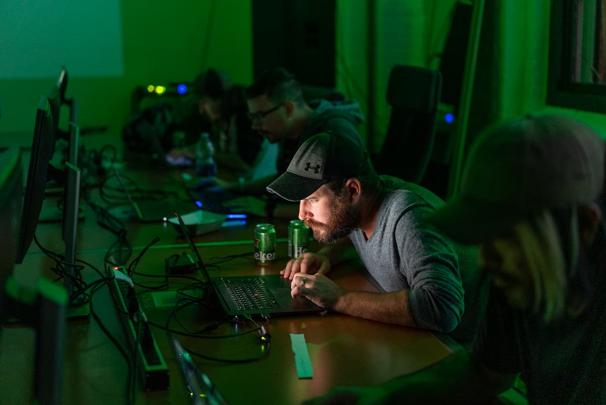
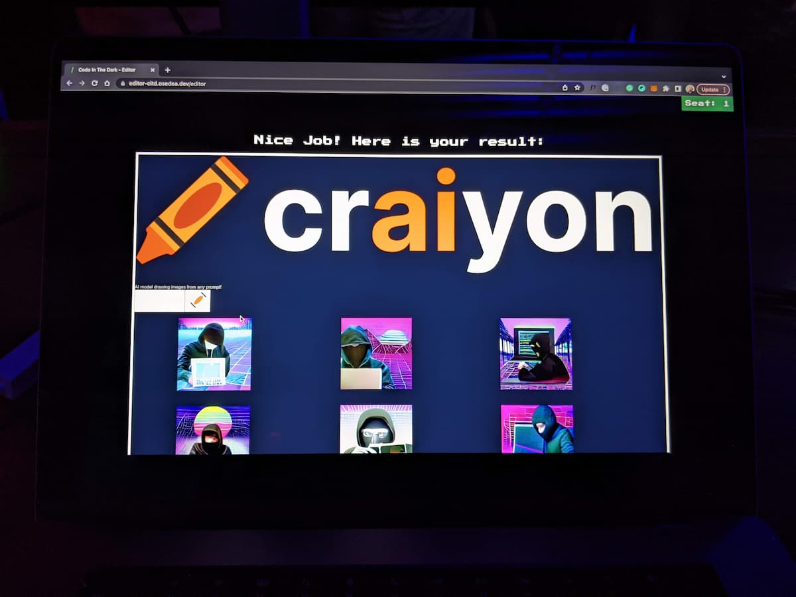
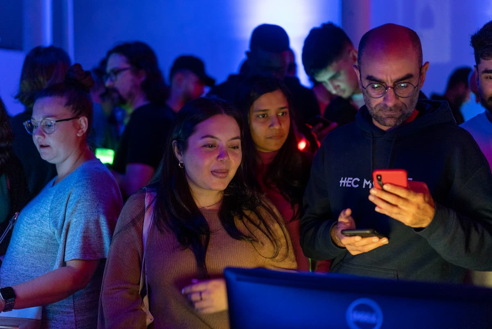
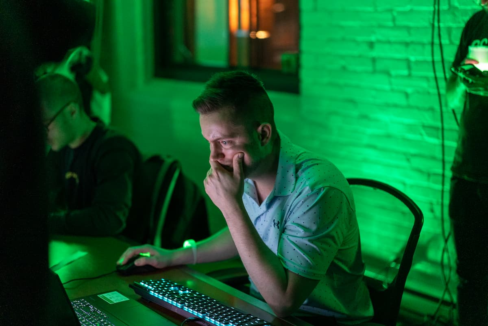
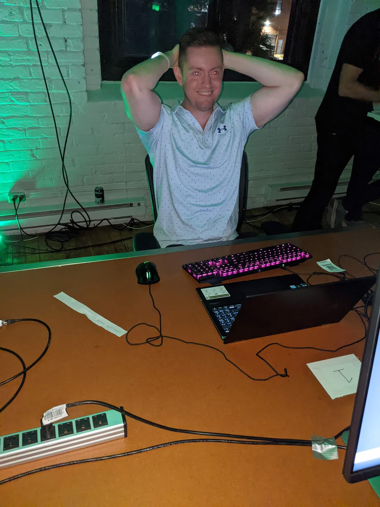
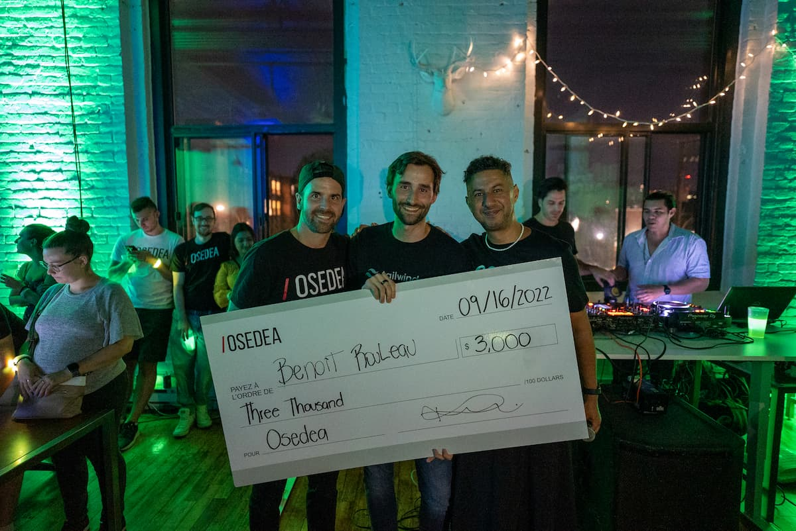

やっほ。[前回](https://quebec3.com/blog/code-in-the-dark-2022)の続きね。

## グループ A (Kyoshin)

僕はグループ A に入れられたんで 1 回戦から出場。早めに席につき手の平をスリスリしながらスタートを待つ。大っぴらに「5 分で終わりますわ。」なんて宣言したせいで隣の木こり風情の選手がやたら絡んで来る。ここはガン無視。集中集中。

競技中の Kyoshin（手前） と木こり

### 戦術

各選手にとって 15 分という時間はまじで一瞬なのだが、僕は今年で 3 回目の参加となるためさすがにペース配分もわかってきた。そう、今回の戦術は至ってシンプル。

1. 画像優先。とにかくできる限り多くの写真を画面に出す。
2. 雑でもいいから 10 分で終わらせ、残りの 5 分でタイポがないかチェックしたり細かな修正に努める。

そんだけ。実は言うとほとんどの選手はプレビュー全く見ないで CSS 書く能力あるのよ、ただ思い描いていることを全部やる時間なんて実際ないのね、なんせ HTML から書かないといけないから。

ようやくっていうか、3 年参加し続けてやっとわかった。この競技のコツはラフに、手広く書く。小さいフォントはガン無視。場合により手のかかるヘッダーもガン無視。とにかく画像。画像。画像。

これに尽きる。

### 司会「終了！手を離して下さい！」

初戦の成果物。与えられた見本と比べると結構メチャクチャだけど、画像は全部格子状に乗っけられたんでまぁまぁかな。

競技終了。席に着いたまま判定を待つ。面白い点の一つなんだけど Code In The Dark には公式のジャッジがいなくて観客自らがモバイルアプリを使って判定を行うんだ。若い人は知らないかもだけど、2000 年代に NHK でやってた[爆笑オンエアバトル](https://ja.wikipedia.org/wiki/%E7%88%86%E7%AC%91%E3%82%AA%E3%83%B3%E3%82%A8%E3%82%A2%E3%83%90%E3%83%88%E3%83%AB)みたいなもんだよ。そういや富士学校にいた時たまに見てたなぁ。

ジャッジはアプリを通じての投票制。Kyoshin は試合開始直前にマイク持つ機会があったんで、比較的観客の印象に残ってるかも。

判定の結果…

### 初戦勝ち抜き。

### 🥳 プップクプー

結果は 10 人中 3 位。3 人勝ち抜けるんでギリギリのところで生き延びた。あっぶねー 😅

まぁ初戦を勝つことが当初の目標だったんで僕はこの時点でもう満足。ていうかもうこれ以上のプレッシャー感じたくないからさ正直もう帰ってもいいよねって思い始める。まぁでも次はグループ B の試合。M 氏が参加するんでここは楽しんでやろうじゃないの。

## グループ B（M 氏）

実は M 氏は前回（2019 年）、2 回勝ち抜いて最終的には決勝戦まで行ったんだよね。そんでギリギリの差で優勝逃してんのよ。そう、M 氏はとにかくデキる子。だからあんまり心配してなかったんだよ。

そしたらさぁ…

おや？

…は？

### M 氏負けやがった。

やっちまった。

あーあ、これで僕一人。うわなんか帰りたい。

その後はグループ C の試合に日本人の女の子が参加してたんで勝手にセコンドに就く。「私ジュニア（駆け出しのエンジニア）なんですよー。」なんて言っていたが、まぁ参加するだけあんた偉いよ。彼女も無事に敗退。

## ファイナル（決勝戦）

絶対おかしいだろ 🤣

1 回戦を勝ち抜いたのだけの Kyoshin はもう決勝進出が決まっている。

というわけでさっそく決勝開始。

### 司会「スタート！」

開始と同時にお題を与えられる。

あれ？

そんなに難しくないかも。

最終課題は毎年難しい複雑なレイアウトのウェブサイトを求められるのだが、なぜか今年は違った。優しい、いや、易しい。

そのうえ、なぜか制限時間も 5 分延長されて 20 分になっている。思うに毎年難しくし過ぎて決勝の結果は各選手ガタガタだからか。各選手の成果物が決勝戦たるに相応しくないと主催者側の判断だろう、今年はグッと難易度が落とされていた。

「ラッキー！」な状況では全くない。

僕にとって簡単ならばそれは皆にとっても同じなのだ。

結果は…

### 負けました 😭

今回勝利を勝ち取ったのは、なんと前回の優勝者であった。あーやっぱこれ運じゃないのね。実力だわ。

優勝賞金の$3000 を手にする勝者（中央）。一緒に働くことになったら CSS はあんたに丸投げさせてもらうよ。

表彰式も終わり M 氏と その彼女と僕はタダ飯を持てるだけ抱え、そそくさと会場を去ったものでした。

バカヤロー

---

## 当事者意識

思った。

学生の頃からスノーボードの大会とか参加してたけどさ「なんでわざわざ金払ってまでこんなプレッシャーを自分に強いるのだろう」と毎回毎回その場に来て思うのよ。（まぁ今回無料だけどさ。）スノーボードの大会だと、助走開始点に立った時点でさ普段飛ばないようなデカいテーブルトップを目の前にして「うわ行きたくねぇな。」とか本気で思うのよ。何してんだろねと。スノーボードは楽しむためにやってたはずなのに今は苦痛だよってさ。

でもさ、やっぱり飛んでみると思ったほど怖くないし、まぁすぐ負けるけど、その後大会の行方がすんごい気になるのよ、誰が勝って誰が負けたとかさ。柄にもなくすんごく首突っ込んじゃう。

僕は実は全くスポーツなんて観戦しない人なんだよ。サッカー観戦もホッケー観戦も野球観戦もワールドカップもオリンピックも全く興味ない。だってどこのチームや国が勝とうが僕の生活に何の影響もないじゃん？そもそもなんで多くの人は自分の生活に全く影響も及ぼさないものにいちいち一喜一憂できるのだろうかとまぁ今も思ってるよ。

でもさ、大会は参加すると違う。あくまで「参加すると」って条件付きだけど、なんていうかまぁ当事者意識っていうのかなそれが芽生える。競技の行方がまるで自分個人の事であるかのような錯覚を受けんだよね。そんで面白くなる。負けた後も。

そんでさ、今回実際に会場に来てみて感じたことは Web 屋の僕はこの世界では一人の当事者なんだということ。Code In The Dark でも 100 人以上の観客が黒い画面に突っ伏してカタカタする変人達をわざわざ金払って見に来んだよ。そんでスゲー盛り上がってんだよ。

僕なんか普段は暗くした部屋でずっと一人でカタカタしてるだけだからさ、そんなのに見る価値があると思っちゃう人がそこそこ存在するという事実を急に目の当たりにしてさ「僕もこの大きなムーブメントの中でも結構アツいポジションにいるんじゃん。😎」なんて勝手に感じちゃって嬉しくなるのよ。

まぁだからこそ僕らに「えーっ？」ちゅうくらいの多額の報酬を払う人や会社がいるんだな。（まぁ今だけかもだけど。）

何が言いたいかっていうと、

### 当事者意識高まるのよ、大会出ると。

だからさ、僕は時々自分に鞭打ってわざわざこういった大会にこれからも参加し続けるつもり。単純に楽しむため、それと高い当事者意識を保つためにね。なんせ毎日勉強するような変態と天才しか残らない業界なんだよ。当事者意識高くしとかないと勉強続かない。

読んでくれてありがとね。最後に大会のビデオ貼っときます。

  <iframe
    style='border:0;'
    src='https://www.youtube.com/embed/ehahLZ4kN_M'
    width={IFRAME.WIDTH}
    height={IFRAME.HEIGHT}
    frameborder='0'
  ></iframe>

したっけ。
