やっほ。

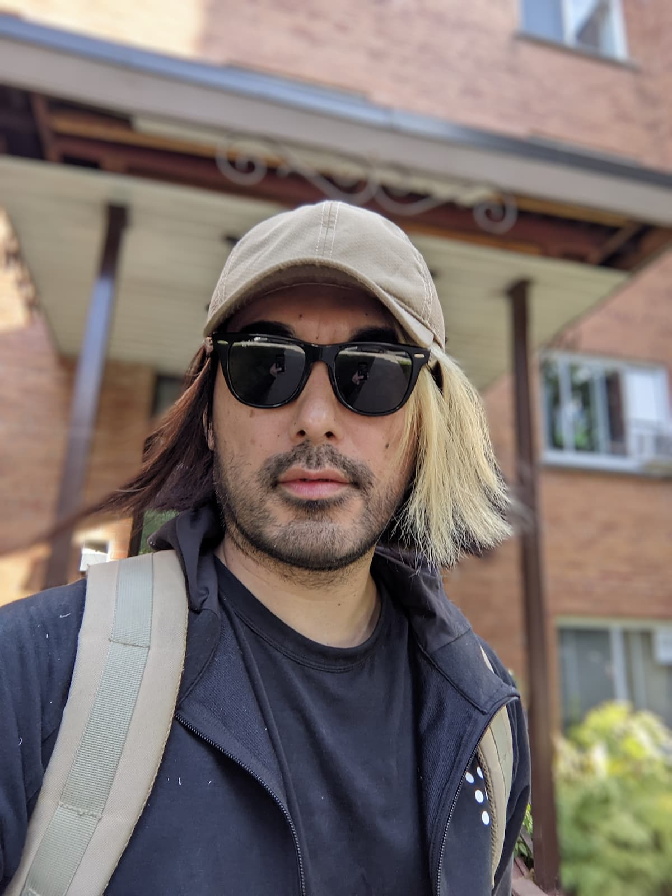
9 月某日。仕事をマジで適当に切り上げて明るいうちから大会会場へ向け出発。久々の高揚感。

みんな大会出てる？

COVID の影響で過去数年間いろんなイベントがキャンセルされてきたけど、さすがに今年はここカナダでも色々なイベントが再び開催され始めてるわ。

## 大会

世の中にはプロ野球とかサッカーの試合観戦とかあるけどさ、最近では e-sports なんていうビデオゲームの大会も出てきたじゃない？賞金額 3000 万とかさぁ凄いよね。羨ましいわ。

そんなかでもあんまメジャーじゃないけど Web 系の大会ってのもあるのよ。その中の一つが[Code In The Dark](https://codeinthedarkmtl.dev/) 。先月にひっそりとモントリオールの片隅で開かれたんだよ。この大会は 2018, 2019 年と過去にも開催されててもちろん[参加してきたんだけど](https://quebec3.com/blog/programming-competition) 2019 年以降は COVID の影響でパッタリ止まってしまってたのよね。それが 2022 年になってようやく復活。僕ら Web 屋にとっては毎年秋の恒例行事だったんだけど、もうすっかり忘れかけてたわそりゃもう最後にやったの 3 年前だもん。

2022 年とある夏の日、元同僚である M 氏からのメールで復活を知ることに。

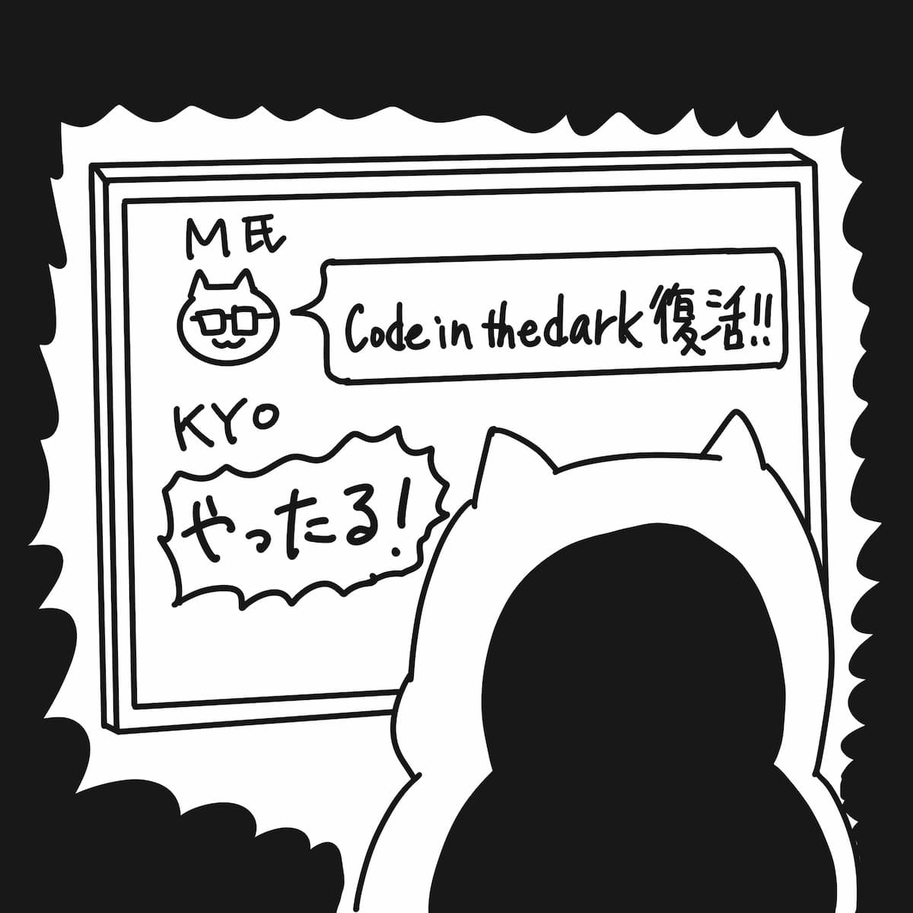

## 9 月 16 日（金）

別に待ちに待ったわけじゃないけど、ダラダラ過ごしてたらあっという間に大会当日。今年はマジでなんの練習もせずに参加。もう勝てる気しないもん。Code In The Dark は[CSS](https://en.wikipedia.org/wiki/CSS)の大会なんだけど僕もう仕事で書いてないのよね。過去 2 年間触れてないのはかなり致命的。ただまぁ CSS は自転車の乗り方と同じようなもんなんで数年触れなかったくらいではさすがに忘れはしない。

…でも正直やっぱ怪しい。最近指プルプル震えちゃうもん。

## 会場入り

大会会場にて 2 年ぶりに M 氏と再会。彼女連れてきてやがる。いやまあしかし 2 年程度じゃさすがに変わらないな、しかし戦場に彼女を連れてくるとは愚か者め。

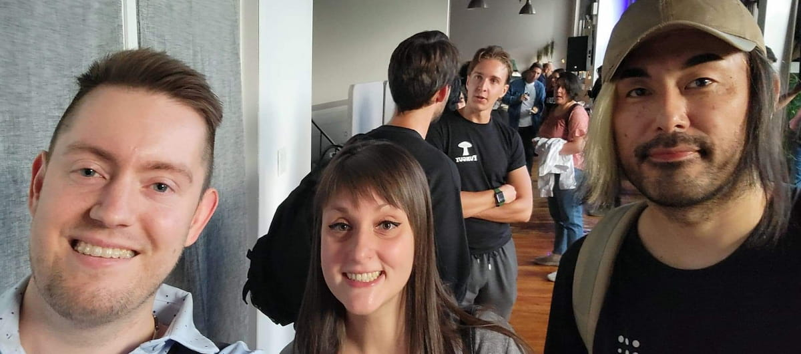
左から M 氏、M 氏の彼女、Kyoshin。M 氏はもうメガネかけてないけど漫画の中ではかけてさせてます。だって区別つかないもん。

Kyoshin「どう、練習した？」

M 氏「いやもー全然。忙しくてさ。」

Kyoshin「ふーん 😏」

信じちゃいけない。M 氏は「全然勉強してねー」アピールしつつテストで良い点取るタイプの人間だ。君のクラスにもこういう奴一人は居たであろう。

それにしても、9 月のモントリオールはまだ日が長く会場は依然明るい。この大会は真っ暗の中開催するから面白いのである。というわけで、我々一同は日が完全に落ちるまで無料飯をペロペロつまみ食いしたり、「ンプンプンプンプ…」を繰り返すだけの奇妙な電子的音楽を無理やり聞かされたりして時間を潰す。

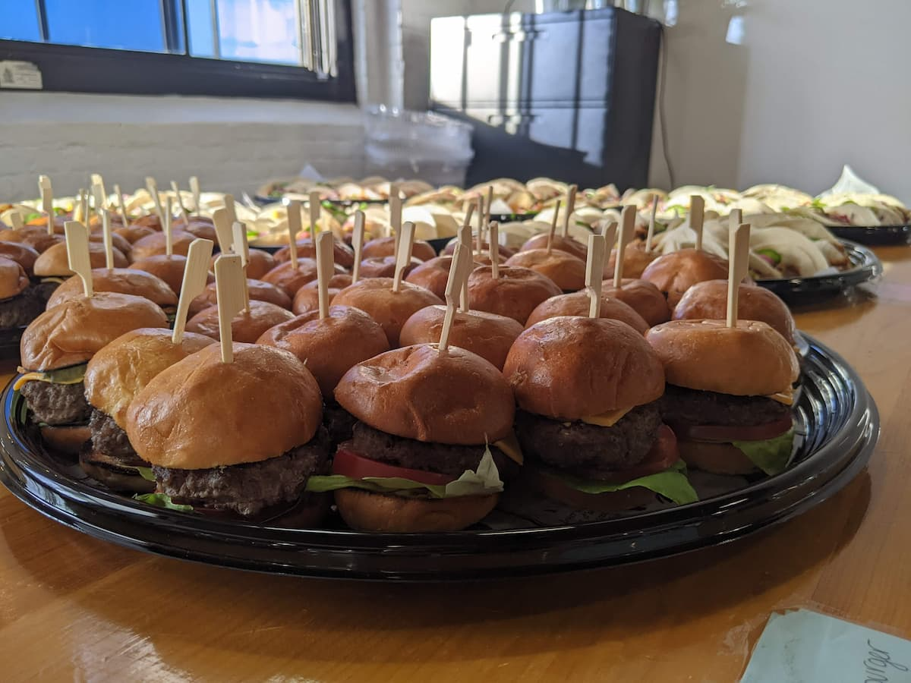
ミニバーガー。美味かったのでポッケに入れて持って帰ってやったわ。

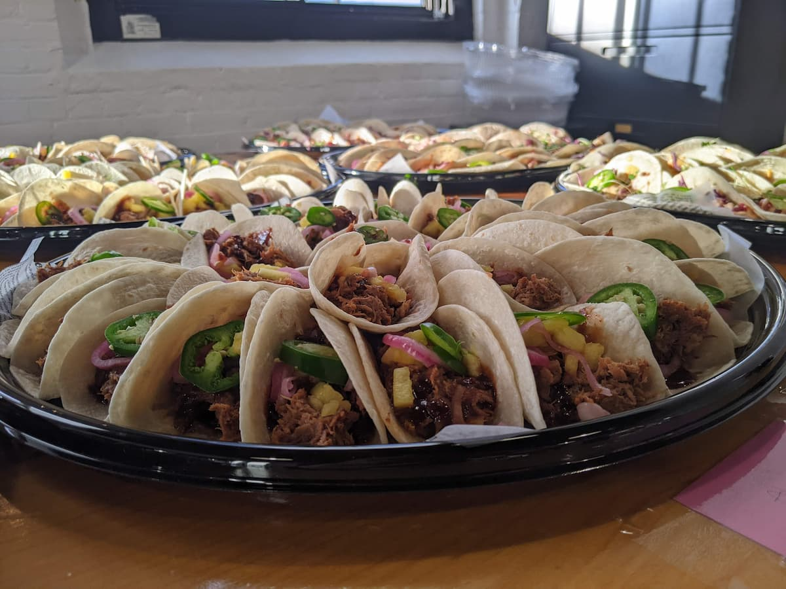
これは美味しいタコスでした。

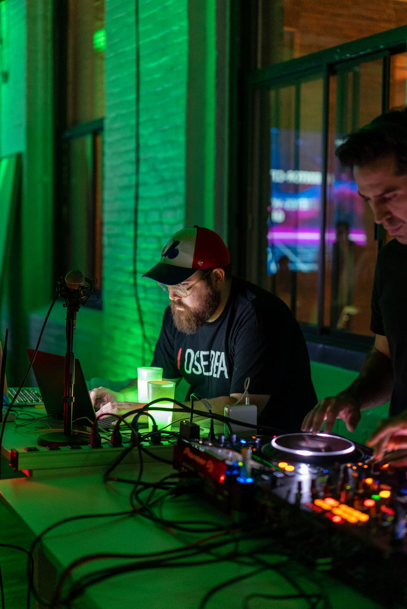
ンプンプ野郎たち

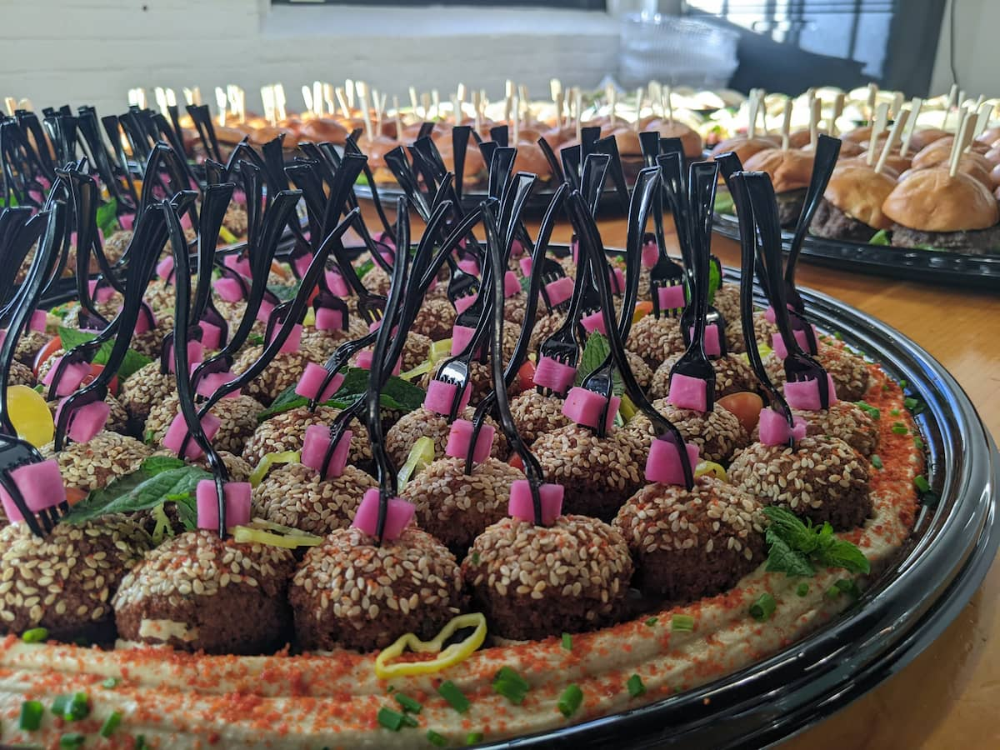
不明食

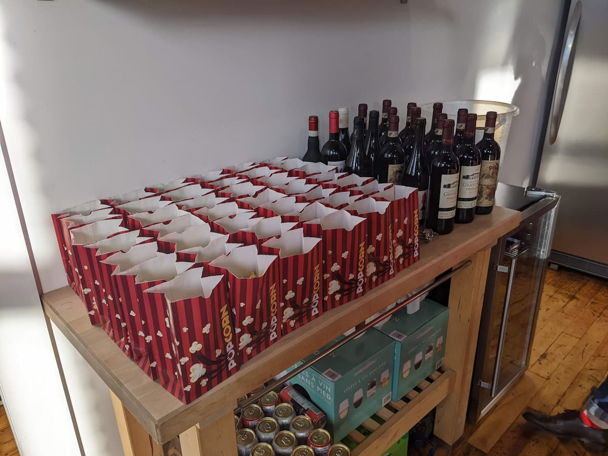
ワインやビールもどんと来い。好きな言葉は「放題」です。

会場にはこれら軽食の他、ビールやワインなどが（競技参加者に限り）何杯でも無料で振る舞われたのだが、アルコール類は罠だ。感覚が鈍っちまうのさ。

まぁ他の競技者にはちょうどいい目くらましだよウヒヒ。僕と M 氏は影でソフトドリンクをすすって喉をうるおす。

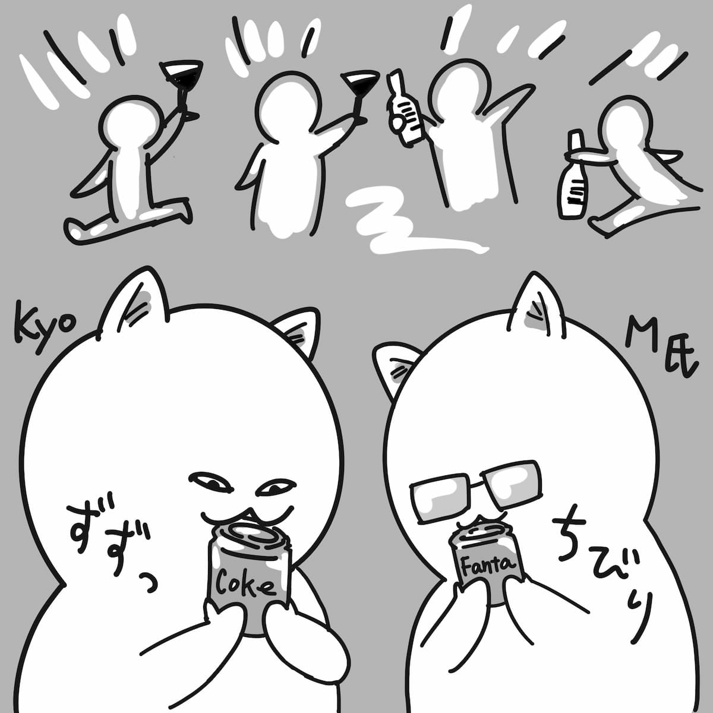
「ファンタうめぇ。」「コーラも悪くないよ。」

## 競技準備

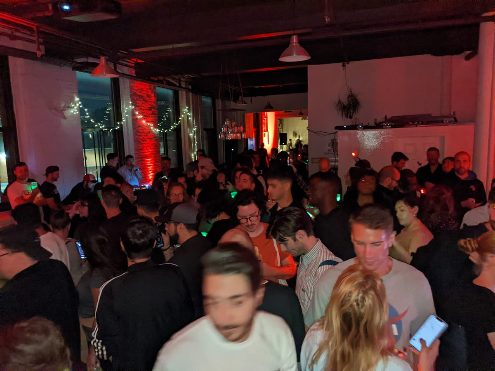

1 時間半も経つと完全に日は落ちたようで会場も十分に暗くなる。観客も競技参加者もそろったようだしそろそろ競技開始だな。

ここで発覚したのだが、今年の参加者はたった 30 人とのこと。例年だと 65-75 人ほどいたはずなので今年は実質半分以下だ。そんでなんとこの人数だと…

**一回戦を勝ち抜いただけで決勝進出してしまうという大会バグが発生。**

笑える。優勝賞金は$3,000。

あれ？

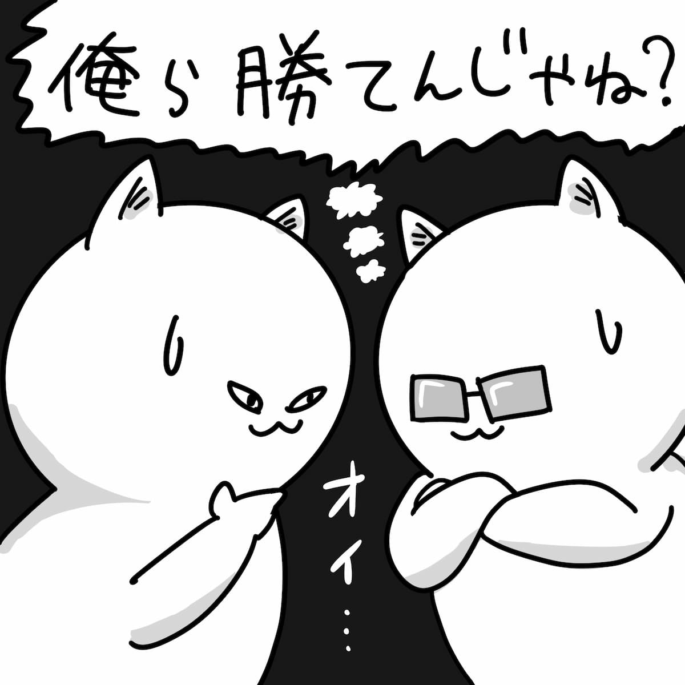

ってなっちゃうよね。マズイお互い落ち着け。

競技は 30 人をそれぞれ A, B, C のグループに分け、そこで勝ち抜いた 3 人が決勝に進む手合いだ。僕はグループ A、M 氏は B。どうやら一回戦で潰し合いになることは避けられそうだ。

ステージに並ぶ僕らの横、司会がルールに関し認識の統一を図る。僕ら競技者は当然よーく知っているのだが一般客への周知のために今一度徹底する。

- 「競技時間は 15 分！」
- 「競技者には一枚の画像（適当なランディングページ等）を与えます。それを HTML と CSS で書き上げてください！」
- 「競技終了まで一切のプレビュー禁止。一瞬でも見たら失格です！」

簡単に言うと Web バージョンの Fukuwarai（福笑い）だ。黒い画面に映る文字だけを頼りに Web ページを書く。

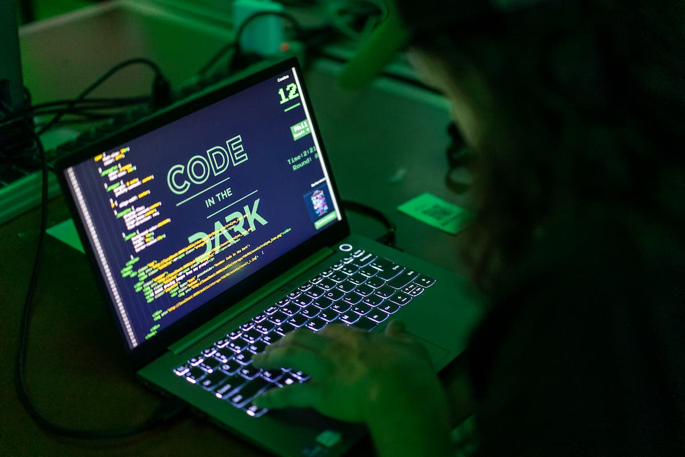
実際の画面はこんな感じ。

…

司会「…以上です！質問ある人？」

…静まり返る会場。さっそく質問だ！

### 「ハイ！」

司会「Kyoshin さん、どうぞ！」

### 「もし 5 分で終わっちゃったらとっとと退出してイイっすか？😎」

## 観客「おおーーーーーーー 🔥🔥🔥🔥🔥🔥🔥🔥」

司会「もちろん構いませんよ。終わるのならね。😅」

盛り上がってまいりました。

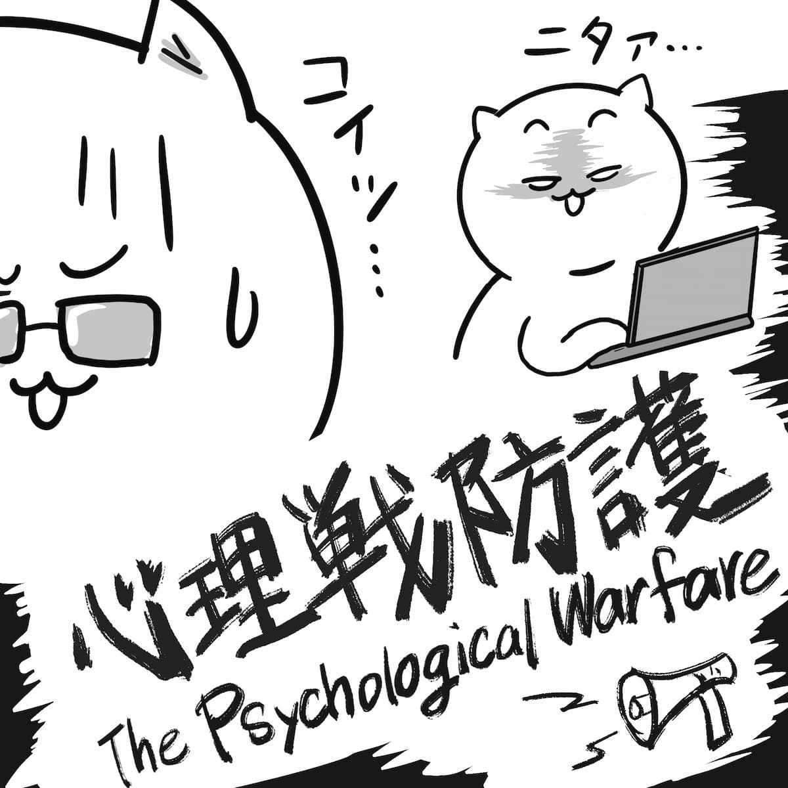
「コイツ…あおってやがる…！」

…戦争はもう始まっているのだよ。

---

というわけで、なんか書き疲れたんで「其の２」に続きます。

読んでくれてありがと。

したっけ。
