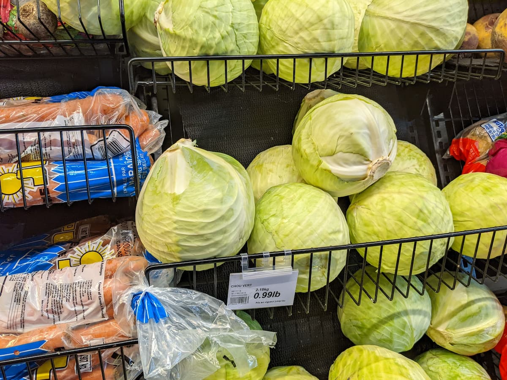
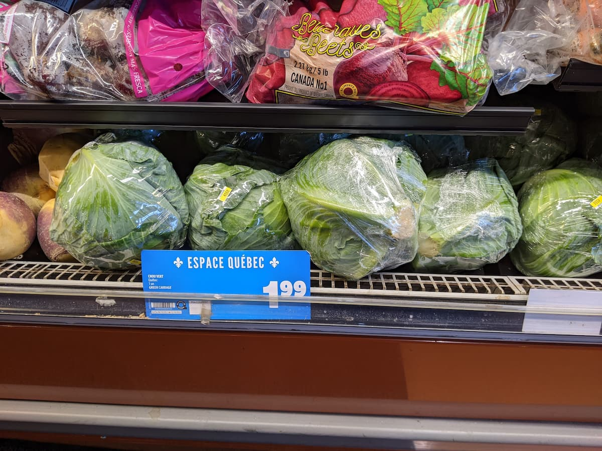
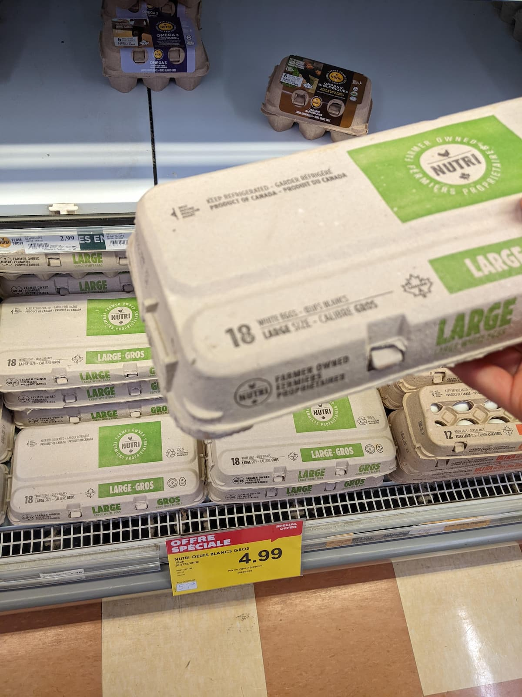
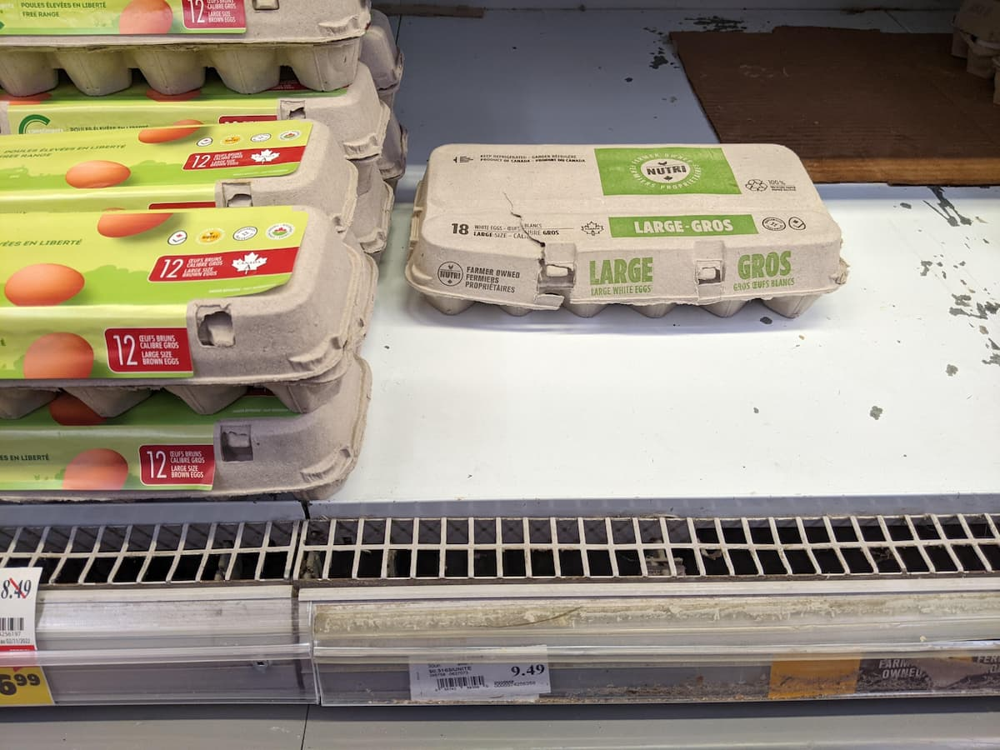
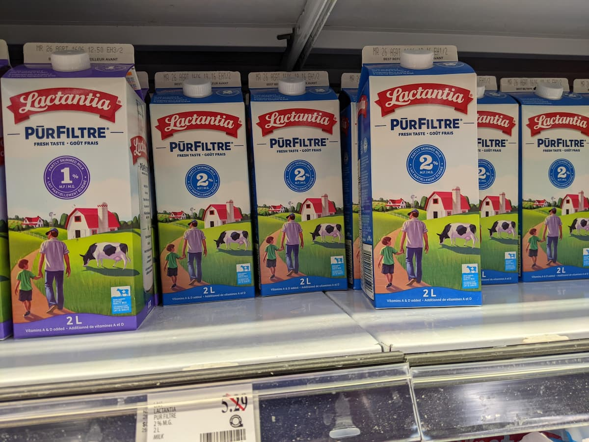
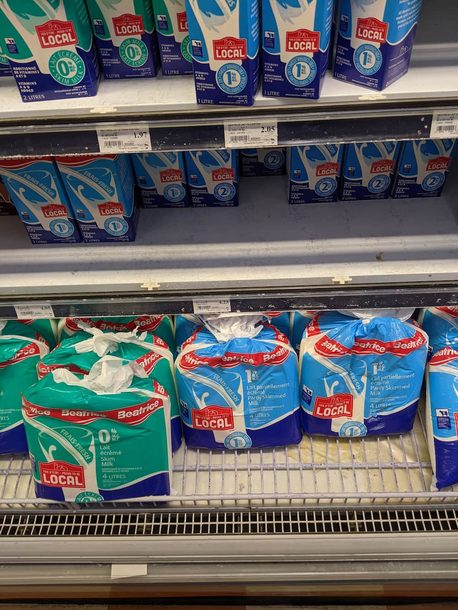
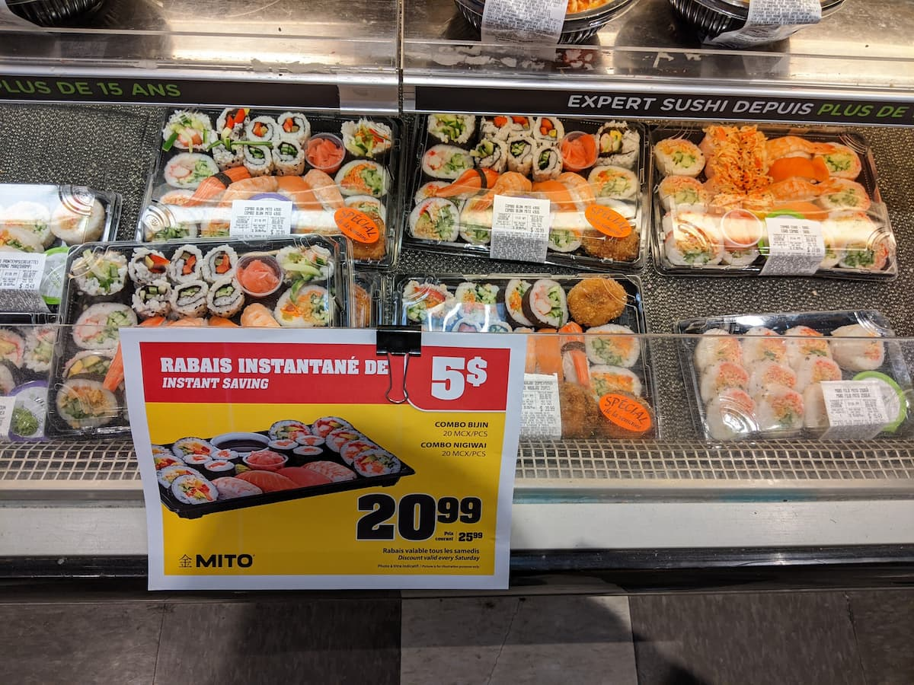

日本と北米の皆さんこんにちは。今回はコンマ 2 分の 1 さんからの質問です。

> カナダって米ドル高の影響はありますか？ 具体的にどんな感じですか？ 私は文化が大好きで、特に現地に住んでいる人の話を聞くのが好きです。 カナダで Kyosin さんに 米ドル高の影響はありましたか。 また、周りのカナダの方々はどんな感じに言っているのでしょうか。 実は日本ってカナダの情報が入ってこないです。（今も） ご存知かも知れませんが… むしろ 10 年前よりカナダの情報が入ってこなくなりました。 というより、他の国の情報が入ってくるので、総合して見ると全体的にカナダの情報が少なくなりましたね…？ 基本的に『アメリカの隣にあるメープルシロップの寒い国、知ってる人はオーロラ』という国です。 余談ですが、現地のメープルシロップ食べましたか？ そして、オーロラ見ましたか？ こちらは本当に余談なので答えられればで大丈夫です。 以上、宜しくお願いいたします。 最後に、私は Kyoshin さんが大好きです。 したっけ。(コンマ 2 分の 1 より)

## カナダって米ドル高の影響はありますか？ 具体的にどんな感じですか？

米ドル高の影響は…

### あります！

具体的にどんな感じかって言われるとどうだろね。まず物の値段とか全然覚えてないわ。食品と炭酸水とトイレットペーパーしか消費しないので週末全部カートに入れてレジまで押すだけの生活だもん。オートパイロット。

そんなんだから今回ちょっと見に行ってきたよ。

都合の良いことに、今年の 2 月に[スーパーマーケットに歩いて行った記事](https://quebec3.com/blog/canada-grocery)書いてさ、そんとき何枚か写真撮ってたから当時の値段と比べてみよ。

当時も今回もスーパーマーケットは [IGA](https://www.iga.net/en)、同じ店舗。IGA はこちらではどこでにでもある中流家庭向けのスーパーです。（今回は触れないけど質はソコソコで安さが売りのスーパーも別にあります。）

### キャベツ

2022 年 2 月

8 ヶ月前のキャベツの値段。1 パウンド（約 450g） 99 セント。「安っ」て思うかもだけど、1 パウンドあたりの値段なのでひと玉買うとたぶん 2 ドルくらいします。

2022 年 10 月

現在の値段 1.99 ドル。ただよくみると今回は一玉の値段のようなのでキャベツの値段はほぼ横ばいってとこでしょーか。「横ばい」の「ばい」って何？

### 卵

2022 年 2 月

8 ヶ月前の卵（18 個入り）。価格は 4.99 ドルだけどセール前の価格は 5.79 ドル。18 個も入って 600 円弱なら妥当な値段なのでは。賞味期限も軽く一ヶ月はある。

2022 年 10 月

現在、同じ 18 個入りが 9.49 ドル。だいぶ上がってほぼ 2 倍。左に 12 個入りもあるけど 8.49 ドル。色付き卵はオシャレな人が買うやつだから比べるのアレだけど、卵は全般に爆上げ。実際 1 カナダドル ＝ 100 円って感覚なので 18 個入りは 1000 円近くするということ。僕はこの潰れたやつ一箱で 1 ヶ月くらい持つと思うわ。

### 牛の乳

2022 年 2 月

2 リッターで 5.29 ドル。

2022 年 10 月

2 リッターで 4.23 ドル。ブランドが違うから厳密さに欠けるけどミルクに関してはほぼ同じ。ちなみに 4 リッター（一番下のやつ）になると容器はビニル袋。持ち上げるとタプタプします。

### 寿司

2022 年 10 月

最近スーパーでも寿司売るとこ増えた。現在の写真しか無いんだけど、このサイズで 2000 円ちょい。日本に比べるとすんごく高く感じるだろうけど外国じゃあ妥当な線でしょう。寿司なんて数年食べてないわ。

## 米ドル高の影響に関し、周りのカナダの方々はどんな感じに言っているのでしょうか。

🤔 カナダ人と仕事の話しかしてないんで分からないなー。でもこのドル高の影響は、物価だけでなくそれなりに給料に反映されてると思うよ。アメリカ、特にニューヨークなんかは従業員の給料爆上げだもんね。ここカナダでも少なからず影響あるわ。もう Costco とかでも時給は最低で 13 ドル、良いとこだど 30 ドルとかくれるからさ、もう週末その辺のコスコで働いてやろうかと思っちゃうくらい。

## むしろ 10 年前よりカナダの情報が入ってこなくなりました。 というより、他の国の情報が入ってくるので、総合して見ると全体的にカナダの情報が少なくなりましたね…？

カナダ地味だからなー。そこがいいんだけど。

## 基本的に『アメリカの隣にあるメープルシロップの寒い国、知ってる人はオーロラ』という国です。

だいたいあってます。でもさすがにオーロラはその辺に無いわ、もっともっと北に行かないと。モントリオールやトロントなんかの位置からも想像つくだろうけど、人口のほどんどは米国との国境沿いに集中してるのよ。国土広過ぎて北はスッカスカ。

## 現地のメープルシロップ食べましたか？ そして、オーロラ見ましたか？

さすがにメープルシロップくらい食べたさ。ごっつい缶に入ったりしてどこでも売ってるもん。でも僕は味の違いが分からないので普段安いコーンシロップ使ってる。

オーロラに関してはカナダでも僕を含め実際に見たことない人の方が圧倒的に多いと思うよ。

### 最後に、私は Kyoshin さんが大好きです。したっけ。

… 5 点あげる。

質問あればいつでもどうぞ。

したっけ。
