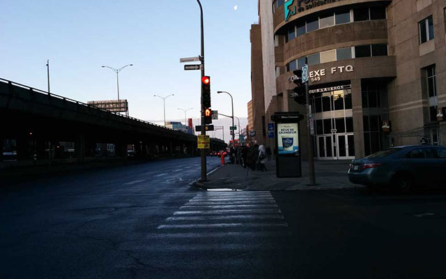
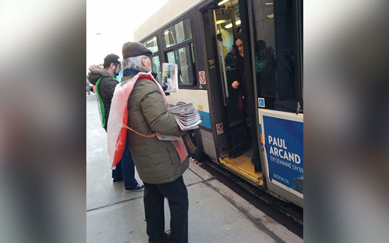
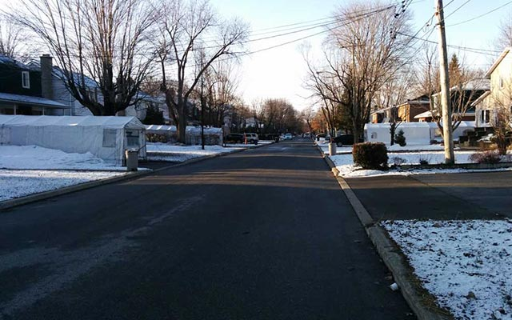
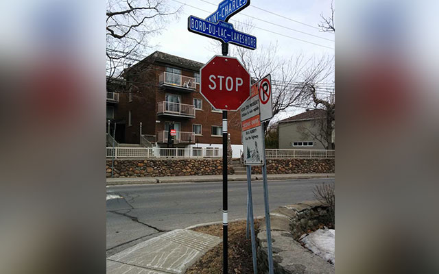
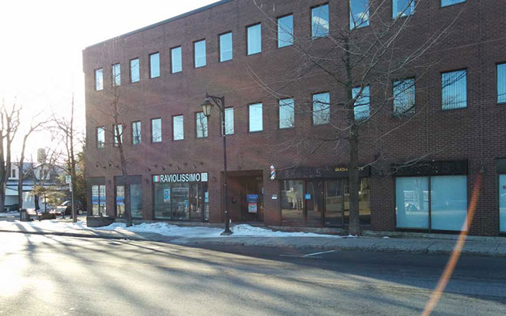
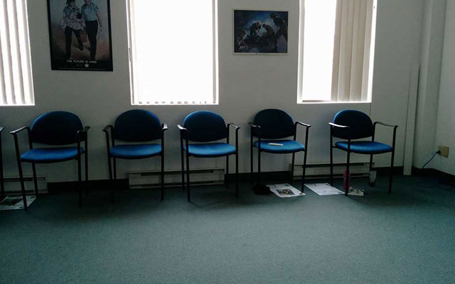
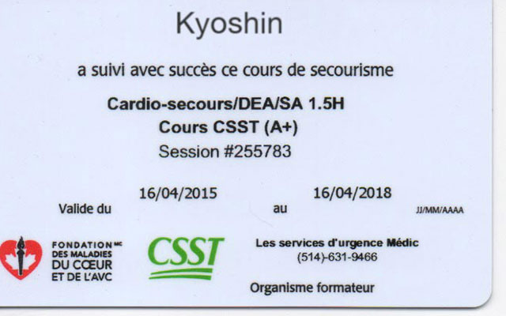
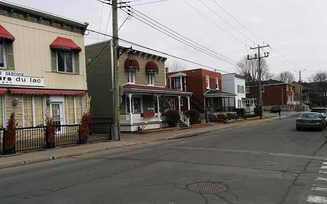
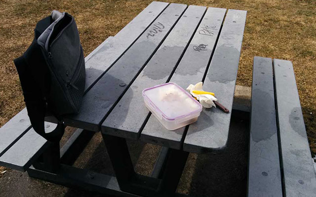

世界中の日本人の皆さんこんにちは。この間、会社の命令で救急法の講習に参加してきたんで、そのことでも書こうかなと思う。
ここカナダでは法律により（きっと日本でもそうだと思うけど）法人はその規模にかかわらず、救急法（心肺蘇生法など）ができる従業員を必ず職場に置かなければならないのだ。50 人規模以下の会社なら 1 人。それ以上の規模なら 2 人といった具合にね。

法律を遵守するためとはいえ専属の救急救命士を雇うわけにはいかないので、会社は特定の従業員をピックアップして、「君、その資格を取ってきなさい。」と命ずるわけだ。

というわけで去年設立したばかりの我が社は、過去に何度か受講経験のあった僕を指名してきた。（自衛官＋セキュリティガードの名目で過去に 5, 6 回は受けているのではないだろうか。）

## 1\. 会場までの道のり

自宅近くのバス停を目指す。

当日、バスを捕まえるため早朝より行動開始。まだ少しばかり暗い。平日の朝ではあるが、いつもと違うことをするので何だか楽しい。

駅前では毎日無料の新聞が配られ未だ多くの人がそれを楽しむ。

バスが到着。待ち構えていたペーパーボーイたちが乗降客に新聞を配り始める。モントリオールでは毎朝見られる光景だ。

その後、バスに揺られること約 50 分、モントリオールの西端に位置する Dorval という地域に到着。会場まではバス降り場から更に徒歩 20 分。遠いな〜。

Dorval の住宅街。寒い。

モントリオールの中心部に比べ、ぐっと道幅が広くなったこの地区。まだまだ遠足気分の僕はコーヒーをすすりながら歩く。

久しぶりにみる英語表記

道路標識がフランス語じゃなくなってる。そう、この地域はイングリッシュスピーカーが幅を利かせている地域なのだ。これなら堂々と英語を話せるな。
（ケベック州は原則として仏語が公用語。店員等に英語で話しかけると「えっ？」みたいな反応が返ってくるときが稀にだがある。）
…ここに住みたい。

なんの変哲もないビル。寒い。

さんざん歩いた末、ようやく 8 時前に会場に到着。今回 MEDIC という組織がオーガナイザーだ。いやー楽しみだな。

小さな教室に 16 人分の席が用意されている。

教室。一般的な日本の授業風景と違い、生徒は指導員をぐるっと囲むかたちで席に着く。ノートをとる人もいるが、ほとんどの人は話をしっかり聞いて理解する形で講習を受ける。
堂々と足を組んでリラックスした姿勢で講習に臨むのも、ここでの一般的なスタイルだ。

## 2\. 退屈とは無縁の講習

いきなりコメディアンみたいな先生がピョンと出てきて講習を始める。非常に若い救命士だが実に話し上手で、分かり易く、かつ面白い。眠たくなるような要素が一つも無い。
久しぶりに大声で笑う。笑いを求めて来たわけではないのだが。

## 3\. 改良を重ねる心肺蘇生法

毎回講習を受けていると気付くのだが、最近またしても心肺蘇生を実施する回数に変更があったようだ。
とにかくシンプルにするのが最近の傾向らしい。確か以前だと、子供にはこの回数、老人にはこの回数実施、なんて細かく分かれていたような気がする。

今回からはもうシンプルに 30 回（心臓マッサージ）/2 回（人工呼吸）で教わった。
患者の状態別に細分化して複雑にするより、誰でも覚えやすいように極力シンプルにして、万が一の際には躊躇せず実施してもらおうじゃないかという趣旨らしい。
実際のところ何回やったかなんて大して重要ではなく、とにかく心臓マッサージや人工呼吸を実施・継続することに意義があるのだし。

## 4\. 救急車は無料ではない

医療費が無料であるここカナダでも、救急車だけは有料だ。残酷なように聞こえるが金のない奴は運んでもらえないのである。金の切れ目が縁の切れ目。さようなら。

日本でこの制度を取り入れるのには賛否両論あるだろうが、僕自身はこの方針に大賛成だ。過去にセキュリティガードを 2 年ほどやってて感じたのだが、救急車をタクシー代わりに使おうとする輩が多すぎる。

客: セキュリティ、救急車を呼んでくれ。

Kyo: いいですけど、お金かかりますよ。

客: …やっぱいいわ。

救急車をタクシー感覚で呼ぶ人間が多ければ、短期的には本来必要であった人のチャンスを奪うことになるし、長期的な影響としては救急隊員の士気も下がるであろう。彼らは聖人でもなんでもないのだ。冗談みたいな理由で何回も呼ばれりゃ、次もそうかもって思っちゃうわな。
救急車の有料化でこれを減らせる。

ちなみにいくら有料だからといって、金が無いなら運びませんよ、というような状況には陥らないので安心を。さっきは言い過ぎたゴメン。
一度呼ばれれば救急隊員はあなたを運ばねばならない。
無事に治療が済んだなら請求書を握りしめ帰宅しよう。お値段は 125 ドル（12500 円）＋ α（距離に比例）だ。
命の値段と考えれば安いものではないか。一方、タクシーと考えればそりゃ高い。だからこういう使い方はやめとこうって心理が働く。

## 5\. 数々の例外規定

まあそれでも救急車は全部が全部有料ってわけでもない。制度をスムーズに運用するための例外はしっかり規定されている。

・自動車事故に起因する出動
そりゃあ患者が複数いれば、誰がどれだけ払うのかって絶対後で揉めるわな。無料で安心。（実際は免許証更新時の手数料を運用して救急車代に充てている。意味不明と思われがちな更新代もこれなら納得。）

・65 歳以上
残念なことにタクシー代わりに呼ぶの人の割合が異様に高い。くそが。おっと。

・職場関連の疾病・事故
職場で誰か倒れたら躊躇せず呼ぼう。

・火事に関連する出動
そりゃそうだ。

## 6\. 最後に

やれやれ、僕はこれが欲しかったんだ。

その他もろもろ実習やらテストやら受けて 2 日（計 16 時間）がかりで講習を終えた。帰り際には一人一人に名前入りの免許証らしきものが配られた。これで人助けが捗るな。
ボスには後日報告するとして、せっかく遠くまで来たんだから周辺をぶらっと歩いてみよう。

通りには個人経営のカフェやレストランが並ぶ。

この地域は英国をルーツにした人たちが多いのか、モントリオール中心部とはまた違った雰囲気の建物が立ち並ぶ。レストランとか雑貨屋等がなんだかお洒落に見えるのは、ただ新鮮なだけか。

なんか腹減ったな。ここでいいや。

なんだかしみったれた公園を見つけたので、そこで昼飯の残りを食べてみる。
僕は基本どこへ行くにもランチ持参だ。食べたら消滅する昼飯に 10 ドルも使うなんて金の無駄だと思う。モントリオールでは 1 コイン（500 円以内) で食べられるところなど無いに等しい。

しかし寒い。めげたので帰る。

読んでくれてありがとう。

したっけ。
