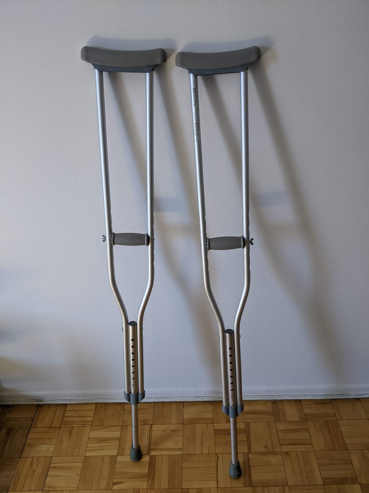

いや昨日さあ、月曜なんだけどさぁ、足痛くってさぁ、会社休んだんだわ。こりゃ足折れたと思ってさ。

ちょっと週末振り返ってみよー。

## 土曜日

痛みが始まったのは土曜の朝、起きた瞬間から左足首に激痛。は？歩けん。トイレ行けないじゃん。実際足を床につけれないくらいヤパイ。

ヒー

トイレからなんとか戻り冷静になって考える。何が起きたの？

まず捻挫（ねんざ）を疑ったけど、ひねってないしそもそも痛い箇所は厳密に言うと関節じゃない。くるぶしより気持ち上のスネの内側。

変だなー。捻挫じゃないなー。

あ、そうか。

きっと仕事中貧乏揺すりし過ぎてたせいで骨にヒビ入ったんだわー。そうだわー。最近ちょっと commit し過ぎたんだわー。労災だわー。

そう思ってた。

ヒビくらいなら一日休んでれば治るはずなので、土曜日は足をガタガタさせないよう気を配りつつ一日中カタカタして過ごした。飯は一週間前に作ったカレーの残り、トイレはペットボトル。非常時だからね。😉

まぁおかげで良いコードが書けたよ。ペットボトル持って就寝。

## 日曜日

朝になってもまだ昨日と同じくらい痛い。患部がふっくらと赤くなってスゴく熱い。

あ、そうか。

きっと白血球が戦ってんだわー。感染症かなんかなんだわー。

感染症くらいなら一日休んでれば治るはずなので、日曜日は足を見ないよう気を配りつつ一日中カタカタして過ごした。飯は一週間前に作ったカレーの残りの最後、トイレはペットボトル。非常時だからね。😉

まぁおかげで昨日と同じくらい良いコードが書けたよ。ペットボトル持って就寝。クセになりそう。

## 月曜日

週末はいつも一瞬で終わる。

おかしいなー。

左足首は月曜の朝になっても同じくらい痛い。赤く腫れててなんか微妙にツヤツヤしてる。そろそろ治っとけっつーの。今日仕事じゃん。

仕事は自宅でやってるから移動に関しては大して問題無いんだけど、今週の金曜日は息子チャンと遊べる日なんだよなー。このまま足痛くて遊べないのやだわー。

病院ってやつ行ってみるか 😞 はーめんどくせ。

## 病院

僕にとっての病院は、今のところ 100％陸自やモントリオール市警に捉えられた後引き渡される施設なので、自ら行くぜ！みたいな手続きとか仕組が少々曖昧（あいまい）である。会社がカバーしてれてる民間の保険があるけど、そういや保険証とか見たことないな。

😞 はーめんどくせ。

普通の人は事前に電話で確認してから行動するんだろうけど、もうそういうのも面倒臭いので近所をググって適当なとこに転がり込んだ。比較的朝早かったからだろうか 2 時間程度の待ち時間で診てもらえることに。

…

お医者さんは丸メガネが似合う初老の背の高ーい白人男性。頭良さそー。

そんでいきなりこれ。

Dr. 「これは gout だね。」

## Gout（痛風）😱

ショックだよ。痛風なんて太ったビール好きのオッサンがなるもんじゃん？

Dr.「お酒普段からたくさん飲むのかい？」

Kyoshin 「先生、よくぞ聞いてくれました。僕は 2020 年以降一滴もお酒飲んでないんですよ。😎」

Dr.「じゃあ痛みが始まる前日にいいものたくさん食べた？ステーキとか？」

Kyoshin 「前日の夜はカレーですね。分厚い beef がゴロゴロ入ったやつです。」

Dr.「その前は？ランチは？」

Kyoshin 「ランチはカレーですね。同じやつです。」

Dr.「じゃあその前の晩は？」

Kyoshin 「その前の晩はカレーですね。同じやつです。」

Dr.「昼は？」

Kyoshin 「昼ももちろんカレーです。同じやつです。」

Dr.「Beef 入ってるやつ？」

Kyoshin 「そのとおりです。何種類も準備しませんよ。ぶっちゃけて言うと先週はずっとカレーです。僕は時間が勿体ないから料理は週に一度って決めてるんです。」

Dr.「君は一週間、朝昼晩同じの食べるの？」

Kyoshin 「まさか。朝は食べませんよ昼と夜だけです。…でも、これからは beef 入れたカレーは連続で食べないよう気をつけます。痛風ですもんね…。」

Dr.「うん。人間は色々なものを食べなくちゃあいけないよ。😉」

Kyoshin 「でも過去に何度か二週間カレーしましたけど大丈夫でしたよ。」

Dr.「うーん…。そもそも同じものを一週間以上食べちゃだめだよ。飽きないのかい？」

Kyoshin 「二週間は流石に飽きましたね。でも面倒臭いからそのまま食べ続けました。頑張れます！」

...

診察後、一応受付に戻る。

受付嬢「どうしました？」

Kyoshin「あのおー…支払いとかってあります？」

受付嬢「え？ないですよ lol お大事に！」

いやーカナダって本当に医療無料なんだなぁー。

## 自宅

病院から薬局寄って薬を買いなんとか帰宅。（薬は無料ではない。）松葉杖も借りてきた。🥳

これさえあれば左足いらず。金曜日遊べる。やったね。

## 最後に

これからは beef を入れたカレーを一週間食べるのやめる。でも他のものは大丈夫だよね。スパゲッティとか。

Beef カレー 1 週間以上は禁止です。三日食べたら残りは冷凍します。

また前みたいに Soylent 食べ始めようかな。でもあれ下痢っぽくなるんだよなぁー。
[食べるのやめてみた Soylent](/blog/soylent 'soylent')

ま、いいや。

したっけねー。

Kyoshin
