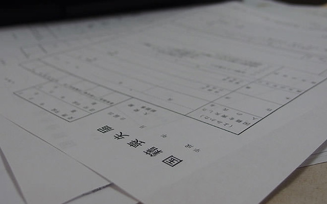
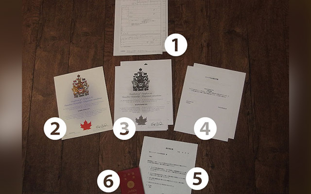
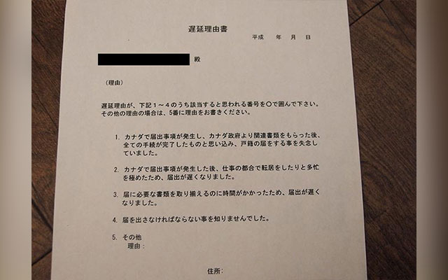
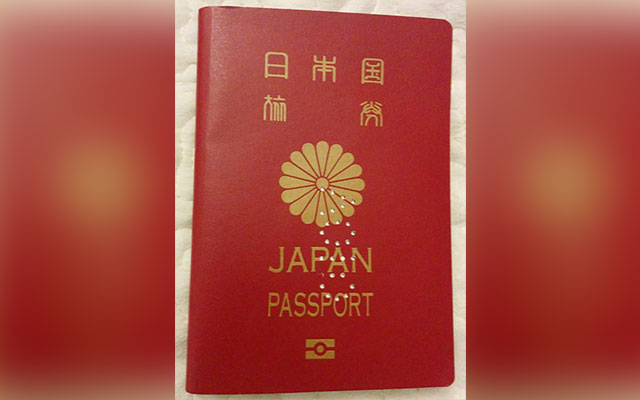

日本の皆さんあけましておめでとございます。

前回は「カナダから離婚届を出す方法」を書いたし、今回は日本国籍を捨てる方法でも書きましょうかね。katakatakata…

## 逃げるは恥だが役に立つの

超がつく長時間労働と意味不明な同調圧力。だいたいなぜ日本ではこんなに長い時間働くことがデフォルトとなっているのだろう。

平日は早朝からベッドに入る寸前まで会社のための時間。会社はやりたい放題だ。そもそも日本では「◯◯ 放題」と呼ばれる定額制が人気。「使い放題」「飲み放題」「食べ放題」。
これと同じ論理なのか、いつからか会社は毎月定額払うことで社員の時間を「使い放題」にした。 仕事が定時の 5 時に終わるのが都市伝説と呼ばれる国。休日出勤がデフォルトの国。16 分に一回の割合で自殺が起きる国。こんな国嫌になったら捨ててしまえばいい。

僕はこのブログで何の自覚もなしに日本のことをボロクソに書くことがよくある。まぁここでは好き勝手に思ったことを書くようにしてるんだけどさ。

最近、あまりに度が過ぎたのか「巨神さんは 日本が嫌いなんですか σ(^\_^;)？ 」とか「そんなに言うなら国籍捨てたらどうです？」ってメッセージが心地よい頻度で届くようになってきた。こういうの読むと心踊っちゃう。

もう、捨てられるんなら捨ててみようと思った。

それに、世界的にみても合法的に国籍放棄できる国って貴重だ。自分のこと棚に上げて言うけど日本は国籍を一体なんだと思ってんだろね。

まぁいいや。

## 日本国籍を捨てる方法

モントリオールにある日本国総領事館のあるビル。ダウンタウンの真ん中にあるのでアクセスは容易。

## 国籍喪失届

さて、実は 2015 年にも一度日本国籍を捨てようと思ったことがあったのだが（過去記事：外国人と参政権と市民権）、その時は方策がわからずじまいで実はウヤムヤにした。しといた。
しかしその後ですね、読者の一人から情報提供があって、どうやら日本領事館に行けば国籍を捨てるための手続きができるとのこと。「国籍喪失届」という書類を提出すれば良いらしい。

「国籍喪失届」在モントリオール日本領事館で貰ってきた。無料。

この国籍喪失届という用紙、その存在自体が驚きだが、外国籍（市民権）を取得した日本人が日本国籍の放棄を可能にする魔法の書類である。

## 多重国籍を受け入れられない日本

というのも、日本は多重国籍を認めていない今時貴重な「先進」工業国なので、仮に日本人である君が自己の意志により外国籍を取得した場合、取得と同時に日本国籍を失うので、国籍の喪失を届け出る必要があるのだ。
ただ実のところ、外国籍を取得したとしても国と国ではお互いに一国民のことについて告げ口し合う文化も義務も義理もないので、自ら「外国籍取得しましたー。」って素直にお国に伝えたりしない限り、多重国籍がバレることはまずない。（日本入国時に外国のパスポート使ったらバレるかな？）
そのためか、海外移住者が居住国の国籍（市民権）を取得したあとでも、それを自分の国に伝えることなくしれっとこれまで通りの生活を続けていることも多いと聞く。ちなみにここで国籍と書いてあるが実際は市民権（citizenship）と呼ばれることが多い。まぁ呼び方は違えど実際同じものよ。

僕は、2014 年に自分の意思でカナダ国籍を取得したし、それを別に隠す必要もないうえ、ことさら日本国籍に固執する理由も義理もないし、なんだか面白そうなのでとっとと捨ててしまおうと思う。

必要なもの。

1.  国籍喪失届２通：日本国領事館で貰える。無料。
2.  市民権証明書等の国籍取得証明書（原本）：提出しないが一応見せる必要がある。
3.  市民権証明書等の国籍取得証明書コピー２通
4.  市民権証明書等の国籍取得証明書の和訳文２通：自分で和訳してよい。
5.  遅延理由書２通：外国籍取得から 3 ヶ月以上経過した人が対象の反省文
6.  日本のパスポート：ついでに失効させときたい。君はもう日本人じゃなくなるのだから。

これら書類を揃えて、君の街にある日本国領事館に提出すればそれで終わり。離婚する方がよほど敷居高いのは一体何故か。

### 1\. 国籍喪失届２通

国籍喪失届。こんな紙切れ一枚で国籍が捨てられるなんと便利な世の中か。

まずは国籍喪失届。日本国領事館が隠し持っているはずなので窓口にて「国籍捨てるんで下さい！」と元気に頼もう。２通必要だがいっぱい間違えそうな君は多めに貰っておけ。
細かい書き方は領事館が「書き方の一例」みたいな用紙を持っているはずなのでそれも貰っておこう。
国籍を捨てる書類にしては冗談みたいにペラッペラだが渡された瞬間爆笑しないようにしたい。
この用紙に書くことはいうと、名前、住所、本籍と理由くらいのもん。こんなものを２通同じく書いて提出すれば晴れて外国人になれちゃうのだから世も末である。ちなみに印鑑持ってない人は拇印で充分。

### 2\. 市民権証明書等の国籍取得証明書（原本）

Certificate of citizenship と呼ばれるもの、この原本は当然提出する必要ないのだが、役人というものはやたらモノホンを見たがる人種なので彼らのためにも提出の際には持参してあげよう。

### 3\. 市民権証明書等の国籍取得証明書コピー２通

上記２のコピー。２通必要。

### 4\. 市民権証明書等の国籍取得証明書の和訳文２通

２の和訳文。これは自分で和訳したものでよい。市民権証明書はそんなに文面は多くないだろうから、まぁ自分で翻訳しても時間はかからないでしょう。がんばり。

### 5\. 遅延理由書２通

大人が書く反省文。
これは全員が提出する必要はなく、僕のケースのように国籍喪失届の提出が外国籍取得から 3 ヶ月以上経っちゃったケースのみ。
というのも日本の法律では、戸籍等に変化があった場合、3 ヶ月以内に日本に通知しなければならない*のだ。それ過ぎると戸籍法違反。正当な理由がないと 5 万円以下の過料*。

> *戸籍法第四一条　外国に在る日本人が、その国の方式に従つて、届出事件に関する証書を作らせたときは、三箇月以内にその国に駐在する日本の大使、行使又は領事にその証書の謄本を提出しなければならない。
> *第一三五条　正当な理由がなくて期間内にすべき届出又は申請をしない者は、五万円以下の過料に処する。

僕の場合は 2014 年に外国籍取得して 2016 年になって通知してるレベルなので、24 ヶ月も遅延している。

しかしながらこんな状況でもこの遅延理由書に従って理由を述べれば、正当な理由が「ないとは言えないのではないか。」とポジティブに解釈してもらえる。日本政府はやっぱりプラス思考のできる子。

### 6\. 日本のパスポート

ちょっとわかりづらいけど VOID（無効）と描かれた穴を開けてもらって失効となる。

どうせもう使えないんだから失効させとけ。

上記１〜６の書類をきっちり揃えて日本国領事館に提出すれば、こちら側でできることは完了。その後、これらの書類は領事館で点検を受けたのち問題なければ外務省に送られ更にそこから本籍地である市町村に送られて、そこで実際の事務手続きがなされるとのこと。
だから実際にちゃんと外国人になったのかなぁっていう最終確認は、ある程度待った後に本籍を置いている市町村に問い合わせるしかないのだろう。領事館は書類の受領から１ヶ月〜１ヶ月半ほどかかるのではと言っていた。こちら側としてはまぁ別に急ぐ理由もない。

これで君は晴れて正式に外国人だ。今後日本ではやたら日本語が流暢な外国人として扱われるが、いちいち驚いたり悲しんだりしないこと。

沖縄は年中夏だな。うん。

実は２週間ほど前まで日本行ってたんだ。日本は７年ほど行ってなかったんで、色々すっかり忘れてて笑えた。
ところで日本人ってすっごく幼く見える。羽田空港に着いて税関の前に並んだ時は「子供が働いてる！」とヒヤリハッとしたものだ。そんくらい幼く見えるのはヒゲを伸ばさない文化、何となく皆サイズが小さいということを僕がすっかり忘れていたからか。

まぁ次の記事にでも詳しく書くわ。

読んでくれてありがとう。

したっけ。
