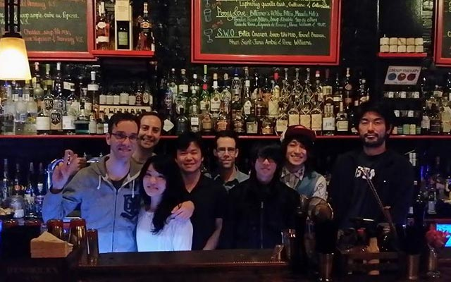
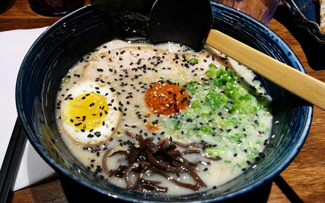
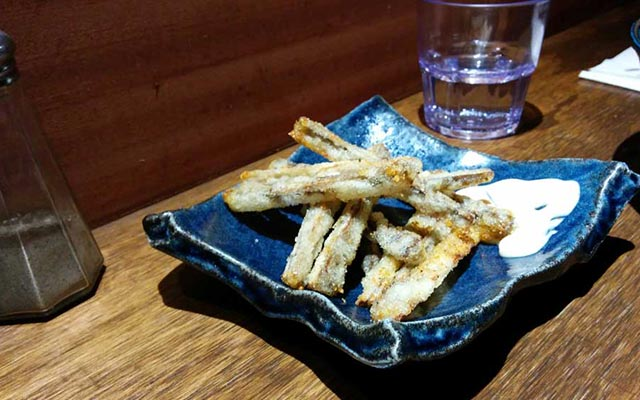
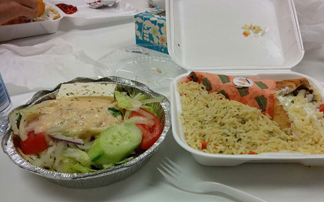
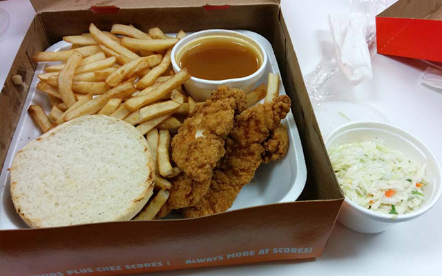
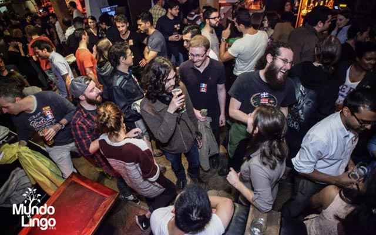
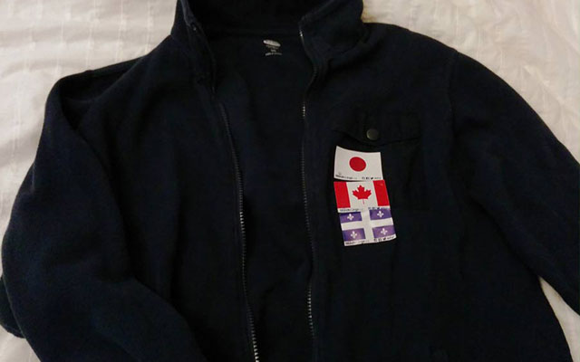
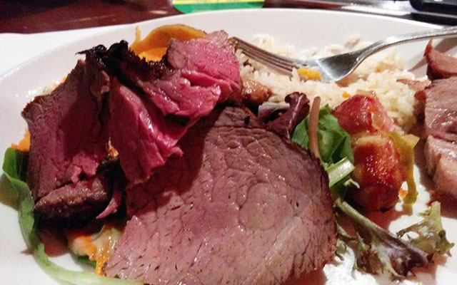
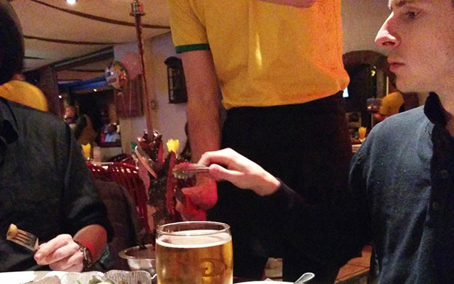
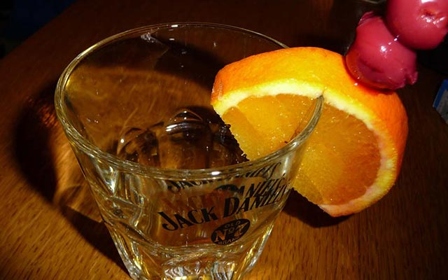

日本の皆さんこんちは。ここ最近やったことでも書きましょかね。ふと思ったんで書き殴ってみる。katakatakatakatakata...

## 11 月 8 日（日）バーとラーメン屋

[バー：Le Lab](http://barlelab.com/ 'Le Lab')

ウェイターに写真を撮ってくれるよう頼んでみると「せっかくだからバーのカウンター内に入っちゃいなよ。」とイキなことを言う。
僕はカナダのこういうところが好きだ。

久々に友人達からお誘いを受けたので遊びに行ってみる。とある日本人の女の子がはるばる「遊びに来た」とのことなので、軽く歓迎でもしようじゃないかって魂胆らしい。彼女は過去にモントリオールに住んでいたのだ。僕は面識ないけど。

当初の予定では、ダウンタウンのはずれに位置するラーメン屋さんで、豚骨ラーメンでもすすろうかって話だったのだが、まぁなんだ、ただラーメン食って解散じゃ寂しんじゃないかってことで、ラーメンの前にバーでも行って軽く一杯ひっかけようぜって話になった。

僕はここでこの夏に来たばかりの日本人男と友達になった。日本人と初めて会うとなると会話の内容は大方、カナダに来た理由や日本でやってた仕事なんかの方面になる。
僕が陸自に在籍していたことを伝えた途端、彼は目をキラキラさせながら幾つもの質問を投げかけてくるではないか。どうやらマニアだ。僕自身も日本語で過去のことを話すのは本当に久しぶりだったので楽しかった。ビールとテキーラの勢いもあってか実際のリアルな失敗談なんかもうまいこと交えて会話も弾んだ。いやしかし珍しい男だ。

[らーめん屋：Yokato Yokabai Ramen](https://www.facebook.com/Yokato-Yokabai-Ramen-House-1420448301592530/ 'Yokato Yokabai Ramen')

辛味噌豚骨ラーメンを注文。豚骨ラーメンなんて 10 年ぶりくらいに食べる。
14 ドル（1400 円）とお高い。海外での日本ラーメンはちょっとした高級食だ。

バーで軽く一杯ひっかけたのち、当初の目的であったラーメン屋へ。ここはこのへんでは珍しく「本物の」豚骨ラーメンを提供している店だ。日本人、九州の人が経営しているのかな。
普通にうまい。ただちょっと量が少なくちと高い。消費税＋チップで 20 ドル（2000 円）近くになる。

友人はアペタイザー（前菜）としてゴボウの天ぷらを注文。ジューシーかつちょっぴり辛めの味付けでウマい。

友人は珍しがってゴボウの天ぷらを注文。たかだかゴボウのくせにここでは「来た来たゴボウゴボウ。」なんて日本マニアのカナダ人達に崇拝されている。（多分僕の周りだけだ。）
ゴボウは日本じゃどこでも愛される日本人に馴染みの深い食材であるが、見た目がただの根っこのせいか一般カナダ人の間では食べ物と認識されていない。「最初に食べようと思った奴は食う物に困ってたのか？」と彼らは口を揃えて言う。

## 木曜日のランチ（会社）

### 11 月 12 日（木）

サラダと豚肉のラップ（手巻きのサンドイッチみたいなもん）とライス。

本日は木曜日。毎週木曜のランチは会社のおごりだ。今週は皆でうんうん唸った結果ギリシャ料理になった。普通にうまい。僕は平日は[流動食しか食べない](/blog/soylent 'Quebec3 soylent')ので味もひとしおである。

### 11 月 19 日（木）

チキンの（ササミ）フライとフレンチフライ、パンが 1 枚とコッテリしたグレービーソース。

今週のランチ。カナディアン達から安定した人気を誇るフライドチキンとフレンチフライ。この手の組み合わせは北アメリカ大陸ではごく普通に見られるランチの王道だ。
チキンもフレンチフライもパンも付属のグレービーソースにどっぷりと浸して食べる。うまい。もちろん体に良いものではないだろうが、週に一度くらいなら良いではないか。

## 11 月 24 日（火）- マルチリンガル交流

[Mundo
Lingo](http://mundolingo.org/montreal 'Mundo
  Lingo')という名の交流会。様々なバックグラウンドを持つ人々が集まる。無料である。

なんだが最近、職場と家の往復しかしてない感じがするので本日はいつもと違うことをやってやろうと思い、とあるイベントに顔を出した。
Mundo Lingo という名の多言語を話す人、または練習したい人達が集まるちょっとしたイベントである。 料金なんかは設定されてなく完全に無料である。貨幣の代わりに言語を交換するからだ。例えば僕なら誰かに日本語を教え、その代わりにフランス語を話せるといった give and take の精神がこのイベントを支えている。 日本語なんて需要があるのかと疑問に思うかもしれないが、こういう場には必ずと言っていいほど日本語を練習したい日本好きなカナダ人がいるものだ。 モントリオールはこういった熱いイベントが毎週どこかで開かれており、そのほとんどが無料だ。これこそまさに都市部に居住するアドバンテージ。使わない手はない。

会場で配られる国旗のステッカーを胸に貼る。一番上が最も得意な言葉を表し、下に行くほど苦手になるといった表示だ。

夕方 7 時に会場である[Clébard](http://www.clebard.ca/ 'Clébard')という名のバーに着けば、ヒゲをモッサモッサに生やしたカナダ人達が適当にまとまって話し込んでいる。ここは[ギルガメッシュの酒場](https://ja.wikipedia.org/wiki/%E3%82%A6%E3%82%A3%E3%82%B6%E3%83%BC%E3%83%89%E3%83%AA%E3%82%A3 'ウィザードリィWiki')だ。

どうしようかとボーッとつっ立っているや否や一人の白人男性が話しかけてきた。彼の胸には日本国旗。どうやら僕と日本語を話したいようだ。

ビールを片手に数人のカナダ人と楽しく話す。中にはこれからカナダ陸軍へ幹部として入隊しようと目論んでいる人、単に女の子を物色しに来た人。一応言語系の交流会なのだが、ここに来る理由は人それぞれで完全に自由だ。 単にオープンマインドを持ってさえすればどんな人でもウェルカムなのだ。

## 11 月 27 日（金）- 職場の飲み会

肉、肉、肉

今日は待ちに待った金曜日だ。ここカナダでは職場の飲みなんてほとんどないのだが（あっても 1 年に 1,2 回程度）、ボスが今週にも会社を離れることになったので最後に皆で肉でも食いながら一杯やろうじゃないかってことになった。
まぁ「皆」って言っても 4 人なんだけど。僕の会社は小さい。

今回来たところは[Milsa](http://lemilsa.com/ 'Milsa')って名のブラジリアンレストランだ。29 ドルで各種肉が食べ放題。豚肉に始まりチキン、サーロインステーキ、ローストビーフ、リブ、ラムステーキ、ソーセージなどなど。その他にもサラダ、焼きマッシュルーム、ライスなんかも付いてくる上に最後はデザートと食後のコーヒーまで用意されている。時間制限なんかないので実質好きなだけ食べる事ことができる。

5-10 分間隔で陽気なブラジリアンが肉を切り分けてくる。調理場から直接運んでくるので肉は熱々のジューシーだ。

BBQ された肉が次から次へと運ばれてくるのでおちおちしてられない。肉はウェイターがその場で好きな分だけスライスしてくれるが、好みの肉じゃなかったり気分が乗らなければ断わっても良い。
この店の常連である我がボスは「最初のうちは安い肉で腹を満たそうとしてくる。当初は断り続けるのがプロだ。」と主張。うちのボスはどうでもいい知識の宝庫だ。彼のアドバイスに従い開始から 30 分ほど僕らはゆっくりとフォークを進めた。

たっぷりの肉とビールで腹を膨らませた 4 人はそのまま近傍のゲームセンターに流れ込む。平均年齢 39 歳、いい歳した大人 4 人が横一線に並んで対戦ゲームで汗をかく光景は異様に映るかもしれない。web 系の会社じゃ普通です。
その後、また喉が渇いたってんで適当なバーに潜入しビールを数杯、ショットを 4 回ほどあおった。僕はショットが好きだ。いやショットをやる文化が好きだ。

カナダのバーでは「とりあえずショット。」が男よ。

結局この日は終電（地下鉄）逃すほどまで盛り上がってしまい一同タクシー帰宅。カナダのタクシーはクソ高い。
モントリオールはそこそこの都会だが、深夜 1:30 過ぎに走ってくれる地下鉄はないのだ。
今回ちょいと散財してみたが、まぁたまにはいいもんだと自分を納得させる。

読んでくれてありがと。

したっけ。
