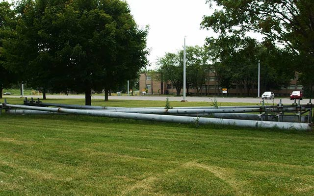
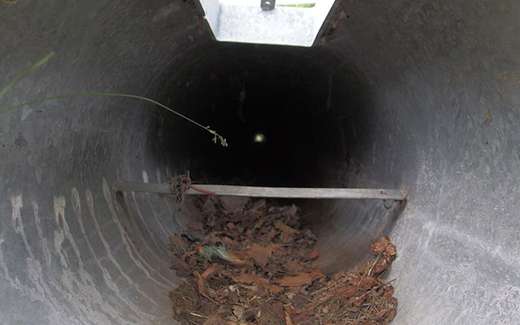
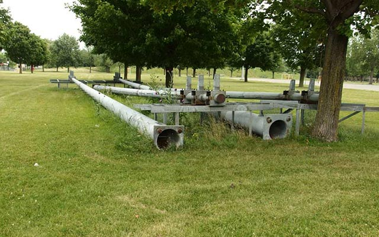
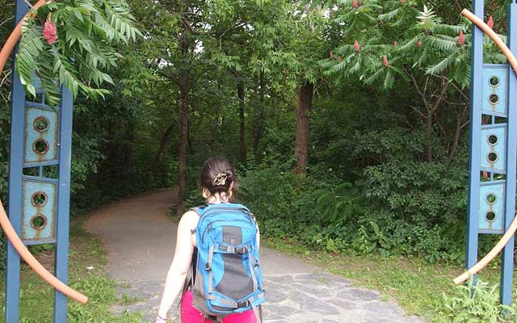
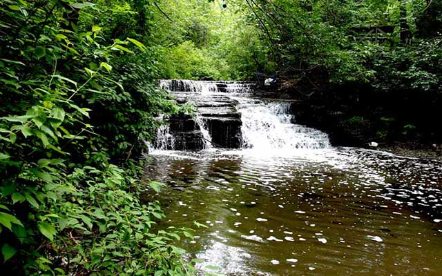
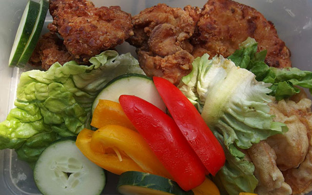
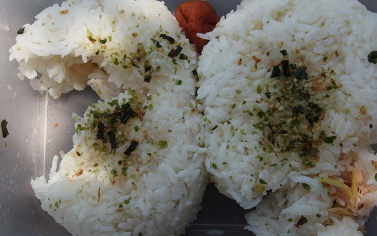

日本の皆さんこんちは。

3 週間ぶりくらいかな。久しぶりに書く。

6 月に Treehouse（プログラミング学習のオンラインレッスン）を始めて以来、ブログを書く時間を積極的に削いで勉強に充ててるよ。始めてみたら思ってた以上に楽しくてさ、ちょっとでも時間ができると机に向かうようになった。

ここ 2 ヶ月でこんなプログラミングの勉強習慣がついた。物を学ぶのに良い傾向だと思う。そういやフランス語勉強してた時もこんな感じだったな。

平日

朝、仕事行く前に 45 分から 30 分
夕方、1 時間から最大 3 時間

週末

0 の時もあれば朝から深夜までの時もある。（変なエラーが出るとムカついて解決するまで寝れない。）

現在フルタイムで仕事してるんで平日はまとまった時間はとれないけど、とにかく毎日少しでも机に向かうようにしてる。

これまでは勉強の時間とブログを書く時間のふたつを確保しながらやってきたけれど、やっぱもっと勉強時間欲しいなと思ってさ。何か書きたくならないように、最近は自分のブログ開かないようにしてた。もともと僕は複数のタスクを満遍なくこなすの苦手なんだ。

まぁいいや。

ここモントリオールも先週はクッソ暑かったな。なんであんな暑くなるかね。

北極圏に大陸サイズの扇風機を設置し、暑い日は凍るような空気を南方に送ってやりたい。

暑いのは空気が停滞してるからだ。これで解決。

まぁその暑い中、先週末は久しぶりにいつもと違うことしたんでそのことでも書くかな。katakatakatakataktakata

## ピクニックに行ってみた。

週末机に向かってるのも体に悪いってことで、彼女と二人でクソ暑い中ピクニックに出かけてみた。場所はモントリオールの北にある Parc-nature du Ruisseau-De Montigny って名の比較的小さな自然公園だ。自然公園なので木と草と水以外特に何もない。なんでここにしたかというと、3 年前彼女と来た際は紅葉がなかなか綺麗だったんで、まぁそこでいいやってことになった。

出発の前日、弁当用に「日本っぽい」おかずをたくさん作ってと彼女にお願い。僕はオニギリを作るからと不公平な条件を提示したにもかかわらず、彼女はレシピを見様見真似で鳥の唐揚げ、サツマイモの天ぷらなんかを作ってくれた。

ちなみに、ご飯、梅干し、鳥の唐揚げと卵焼なんかで構成される日本風の弁当は、Bento という英語名でここ最近北米にも広まってきている。
Bento 恐るべし。

当日朝、バスで揺られること 40 分。

到着。

近い。

土曜の朝ということもあるが、ダウンタウンから遠く離れたこの地域は人の気配が皆無。

公園まではバス降り場から徒歩 5 分。周りは閑静な住宅街である。

お、電柱が落ちてる。

公園までの道すがら、放置された電柱群を確認。さすがカナダ落とし物のスケールが違う。

電柱の中って空洞なんだ。一応知ってたけど見るの初めてだ。

頭を突っ込んでみる。遠くに向こう側の景色が見える。電柱って貫通してるのか。ふーん。

10 分ほど電柱を叩いたり乗っかったり散々ジャンプしたらさすがに満足したので、遠く道端で待つ彼女に合流。 「何が楽しいの？」と呆れていた彼女に「横倒しになった電柱をもてあそぶ機会の尊さ」を説明したが理解を得られなかった。まぁいいや。

## 自然公園 Parc-nature du Ruisseau-De Montigny

入り口。残念なデザインのモニュメントがいい味。

そうこうしてるうちに到着。なんか懐かしいなぁ。

中に入ると湿度がグッと上昇する。実は、森の中は結構涼しいんじゃないかと淡い期待を持っていたのだが、どうやら僕の勘違いのようだ。うっそうとした植生が外部からの風を完全にブロックするので、森の中は蒸し風呂のように暑い。真夏日に来るところじゃなかったか。

森の中はクソ暑いのだが、奥に行けば小川が流れている地域があるはずだ。彼女の誘導に従いそれを目指すことに。

石の階段、水が少ないときは歩いて向こう岸に渡れる。

獣道をかき分けるて進むこと数分、目指す小川のほとりにあっさり着いた。涼を求めて来たのに川のおかげで湿度がさらに上がり、不快指数は天井知らず。森の入り口から我々にまとわりついていた蚊の数もだんだん半端なくなってくる。

そよそよと流れる水を見るのは悪くない。ただ、あまりに蚊が多くてもう景色が全く目に入ってこない。

こっちの蚊はサイズも大きく、刺された瞬間にチクっとするので幸いにもすぐ気が付く。大抵遅いけど。それにしても蚊に刺されて痛みを感じるのなんて生まれての経験。何なの。

あまりの蚊の多さとその凶暴にやられてほんの数分で去ることに。

僕は数十カ所、彼女も 5, 6 箇所刺される。僕は日本育ちであるため、こちらの蚊に対する免疫力ゼロである。患部が怖いぐらい腫れあがった。凄まじく痒い。
一方でローカルの彼女は全然。どこ刺されたのか全くわからない。一応痒いとは言っていたが。

## 昼食

もう自然などどうでもいい。この時期の川辺は凶暴な蚊に支配されてる。さっさと水場を離れてどっかで昼飯にしよう。

鳥の唐揚げ、サツマイモの天ぷらときゅうりとか。

二人で木陰のベンチに座って Bento を食らう。ちょっと固めに揚げられた鳥がうまい。

梅干しと鮭のオニギリ前の晩に酔っ払って握ったオニギリ。一応、梅干しと鮭。デカすぎて割れている。

---

今回は軽くこんなもんで締めよう。

上記の公園以外でも、モントリオールには公共交通機関を使ってアクセスできる自然公園が幾つもある。夏は天気のいい日が多いし、手軽にバスを使ってモントリオール島内にある公園巡りをするだけでも、それなりにカナダらしさを堪能できるのだ。

また涼しい日にやろう。無料だし。

読んでくれてありがとう。

したっけ。
