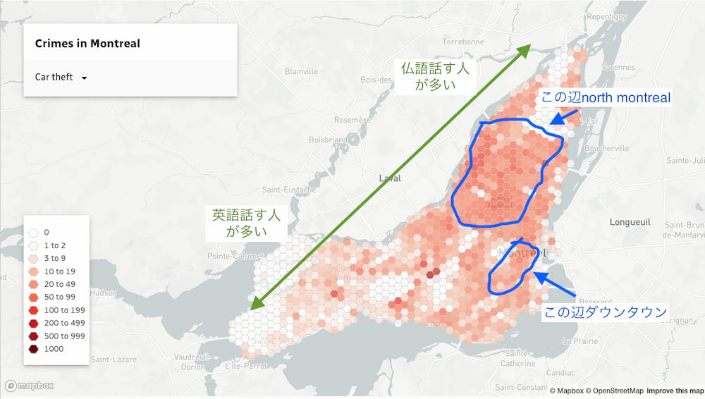

日本の皆さんこんちは、今回はこの質問に答えようかな。

> はじめまして。 いつも興味深く拝読しております！ 来年モントリオール留学したいと考えていますが、寒さにおびえております。 過去記事で、「寒いという人は装備がきちんとしていない」と書かれていましたが、どのような装備をすれば九州育ちの寒がりでもモントリオールの冬を乗り切れますでしょうか。 また、モントリオールの治安はいかがでしょうか。 一番安全そうな地区、絶対住まない方が良い地区などございましたら教えて頂けましたら幸いです。 図々しくお尋ねしてしまいまして申し訳ございません。 これからもブログを楽しみにしております！（まみー）

まみーさん、質問ありがとう。

さっそく質問に答えていこうかな。まずは気候から。

> どのような装備をすれば九州育ちの寒がりでもモントリオールの冬を乗り切れますでしょうか。

## 冬の装備について

一般的にダウンジャケットなんかがおすすめですね。防水性があり、フードがついてるものが良いです。日本ではフードはただのかざりですが、カナダではそこそこの頻度で使います。

ただ、寒冷地で一番大事なのは末端を保護すること。末端とは手、耳、足の先です。

手袋は別にスキーなんかで使うような立派なものは全く必要ないです。ウールの手袋一枚から始めましょう。耳もニットキャップひとつで十分。足はその辺のスポーツ店で売っている冬用のトレッキングシューズが良いです。というのも冬の靴選びで重要なのは防寒性もそうなのですが、それと同じように大事なのは防水性です。その点アウトドアブランドが作るシューズなんかはソールもしっかりしており、防水性も高いものが多く、タフだしおすすめです。モントリオールは日本に比べると除雪がしっかりなされる地域なので、よほどの早起きでもない限り足が埋まるほどの雪をかき分けて進む状況にはなかなかなりません。そのため靴の高さはそんなに重要ではないです。ただ外を歩くことが多いのなら SOREL というブランドのものが値段も手頃なのが多く作りもしっかりしているのでおすすめです。日本にあるのかどうかわかりませんがこっちではどこでも売ってます。現地に来てから買うのもありですね。

試着をする際は、足の指先が靴の中で動かせないほどのきっちりしたサイズ感のものはできれば避けましょう。靴の中で指先を動かせる余裕が少しでもあると、それらを自発的に動かすことで冷たくなるのを（ある程度ですが）予防できるからです。この辺の見極めはちょっと難しいのですが、決してオーバーサイズを買うことをおすすめしているわけではないので注意してください。一般につま先のスペースに余裕がないデザイン（先端がとがっていたりするもの）や、お店で履いてみて「指先動かせないなぁ。」と感じるものは避けるとよいでしょう。特に冬は厚めの靴下を履くでしょうから実際もっとキツく感じるはずです。試着の際には冬に履くであろう靴下を持参するのも悪くないですね。

ただ冬でもカナダは日によって気温の振れ幅が大きいので、前日積もった雪が解けて街が水たまりだらけになることや氷混じりの雨が降る日もあります。防水性重視でいきましょう。

顔については、別に外で仕事するわけでなければそれを覆うようなものは必要ありません。-35 度でも全力疾走したりしない限り普通に呼吸できます。

というかカナダではあまりに寒い日には（-30 度とか）学校などが休校になったり、職種によりますが、会社から家で仕事するよう指示が出たりするのでそんなに心配しなくても良いかもしれません。

あとはそーですね…まみーさんは九州育ちということなので冬の日差しの強さに驚くかもしれません。雪のせいです。街がそれ一面で覆われると夏なんかよりもずっとギラギラするので目がやられます。サングラスも必要になるでしょう。ただ、これらは現地のコンビニや薬局なんかで安くてそこそこ性能のものが気軽に手に入るので（デザインはイマイチですが）今は心配しなくてよいです。

## 気温について

冬の気温はだいたい平均で、-15 度前後がくらいですかね。たまに-20 から-30 度ちかくまで下がる時もありますが、ずーっと続くわけでなく一時的に数日間続くとかそんなもんです。それが一冬に数回あるくらいですね。

数字だけ見ると随分寒いように感じるでしょうが、実はカナダの気象情報は気温を体感温度で示すことになっているため、風が強くなればなるほど気温が低く表示されるのです。日本では体感温度ではなく実際の気温（風速や湿度を考慮しない）を発表するのでカナダにくらべると穏やかにうつりますが実際はもっと寒いはずですよ。例えば日本では「本日の最低気温は-10 度です。」って気象庁が発表しても、体感気温は-15 から-20 度まで下がっているはずです。風の全く無い日なんてほとんどありませんから。

その点カナダはより人間の感覚に近いやりかたで気象情報を発しているのです。ニュースでの気温を単純に比べるとこちらは極端に低くなるでしょうが、上記の理由からですのでそんなに恐ることはないのです。ぶっちゃけ北海道とあんま変わんないです。

余談ですが、僕も久留米に一年住んだ経験があるのですが、そっちの方がカナダや北海道より寒いという印象です。家の中まで寒いんですもん。カナダや北海道は確かに外は寒いですが、建物内は（一般家庭も含め）ずっと暖かく、冬でも T シャツ一枚で過ごせます。日本の冬の方がよっぽどタチ悪いし体にこたえます。

カナダのアパートでは暖房がセントラルヒーティングで家賃に含まれているところもあり、そういうとこは全ての部屋で暖房ガンガンなので僕らは真冬でも T シャツ一枚でアイスを食べて過ごします。暑すぎることは悪いことではないのです。窓を開けて調整できますから。😎

## 治安について

この図を見て分かる通り、ダウンタウン近辺と north montreal と呼ばれる地域が比較的治安悪いです。ダウンタウンはそもそも住む場所ではないのでよいのですが、north montreal に住むのは避けるのが無難です。まぁ悪いって言っても歩いてるところで急に殺されたりするようなレベルでもないのでそんなに気にすることないですが…。この二点の地域の色が濃いのは単に他の地域の治安が随分と良いからです。モントリオールは他のメトロポリタンに比べるとずっと治安が良い方なのです。

地域別に治安を案ずるよりアパート選びに慎重になりましょう。家賃により振れ幅が大きいです。

極端に安いところは住民が荒れてるところ多いので避けるのがベストです。今あるかはわかりませんが、家賃$700 以下のところは住民の民度が低い確率がグッとあがります。要はうるさいです。ただ、移民の家族なんかで子供が多いところの騒音は全く問題ないと思います。彼らは夜寝ますからね。問題は学生でもない若い人が住んでる安アパートです。僕の経験から、彼らは夜中に平気でパーティを始めたり、友人を集めてクラックなんかを楽しんだりします。安いアパートは壁の厚さもそれなりなので、そりゃもうメチャクチャうるさくなります。ブチ切れて怒鳴り込んでも数時間後には元に戻ります。もし運悪く引っ越し先がこのような場合、自分で解決しようとせずとっとと警察（911）を呼びましょう。一晩に 2 回警察が呼ばれることになると、単なる騒音だとしても警察は彼らに罰金チケットを切ります。恨まれても気にせず積極的に警察を利用し、それでも改善しないようなら大家に直談判して契約解除を申し出ましょう。初めは大家も首を縦に振らないでしょうが「身の危険を感じるので市に相談します。」と言い放てば大丈夫です。実際、市が運営する 311 という便利な電話番号があります。そこに電話をして身の危険を感じていることを伝えましょう。その旨を全て大家に伝えればまず契約解除に応じてくれます。

アパート選びでのおすすめは三階建てとかそれ以上の大型アパートです。見た目がちょっと古臭いのも多くありますが、壁が鉄筋コンクリート製で防音効果が高く、家賃もそこそこ抑えられているのに暖房費や電気代も家賃に含まれているといったとこも多く満足度は高いです。

あと余談ですが、上の図にあるようにモントリオールも英語を話す人が多い地域と仏語を話す人が多い地域に分かれています。一般に西に行くほど英語率が高く東に行くほど仏語率が高くなります。西に行くほど経済的に余裕のある家庭が多く、東に行くほどその逆の傾向が見られます。僕は普段英語なのでかなり西の地域に住んでます。ただ、モントリオールっぽさを感じた生活を求めるのなら東側に住むのがおすすめです。建物なんかもヨーロッパのような可愛らしい造りのものが多いのは東側です。僕の住んでる西側はその点でいうと人口密度も低く道路も幅広く建物もコンクリート製のノッペリとしたものが多く、アメリカの田舎みたいな感じです。

さて、こんなもんで質問の答えになったかな？

まぁ頑張ってでも暮らしてみる甲斐ありますよ。学ぶことが多いです。

読んでくれてありがとねー。

したっけ。
