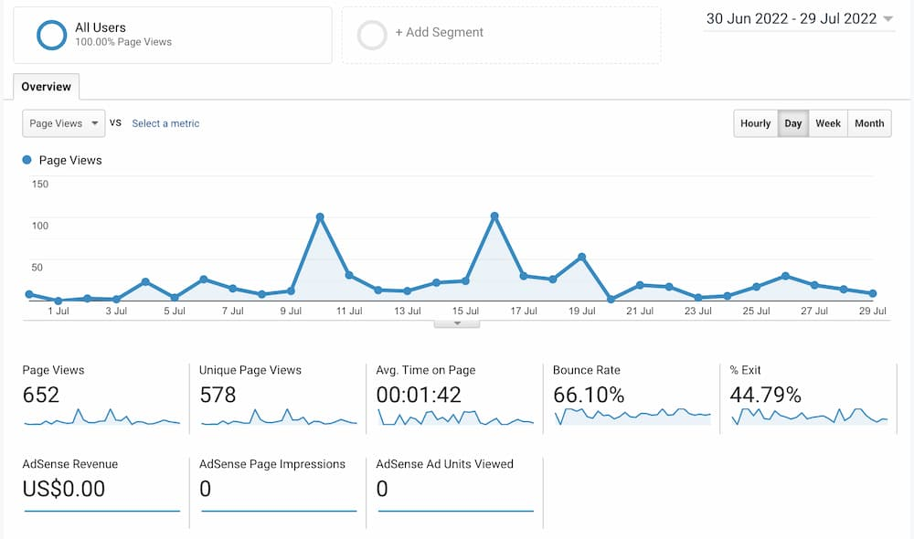

久々に紙に絵描いた。子供用の色鉛筆だけどなかなかあなどれない。面白いかも〜。

今日も質問に答えていきます。

## 質問

> こんにちは。
> （１） このブログのリマインド設定人数と、 記事の一日の閲覧回数(全記事総合で)はどのくらいですか。
> （２） モントリオールにはゴキブリは出ますか。 主(Kyosin さん)は、 ゴキブリをどうやってやっつけていますか。 ゴキブリ大丈夫な方ですか。
> （３） 名前を Kyoshin にした理由を教えてください。 ※Kyoshin を調べたら、ゲームキャラクターのようなものが出てきました。
> （４） 実生活で、カナダネーム（英語名・フランス語名）を持っていますか？ 普段働くときの名前は日本語名・カナダ名どちらですか？
> （５） 息子さんは何語(日・英・仏？)を話していますか？
> （６） 「したっけ」って北海道の方言のようですが、 北海道出身ですか？

> 最近一番アツい記事がこの Quebec3 です。 もっと有名になっても良いような気がします。 それくらい面白い記事です。 有名になったらアクセス数が増えるので 管理が大変かもしれませんが…（汗） カナダにはない挨拶だと思いますが、 「お疲れ様です」。 体調に気をつけてお過ごしください。

> （読者 α 号より）

読者 α 号さん質問ありがとねー。

んーー、１個ずつ行きます。

## このブログのリマインド設定人数と、 記事の一日の閲覧回数(全記事総合で)はどのくらいですか。

リマインド人数。要は「新着記事のお知らせ」をサブスクしてる人ですね。

### 50 (ごじゅう)

ちょうど 50 人です。少なって思えるけど、まぁ地球上に 50 人もこんなオッサンの話を聞きたいって人がいるんだから凄いことだよインターネットって。

🤔 　閲覧回数どんくらいだろ？

最後にそういうの確認したのいつだったかも忘れたよ。広告取っ払ってからはもう閲覧回数も見てないな。実際ほとんど無いはずよ。

ちょっと昨日（7 月 29 日）のトラフィック見てみるか。

### 9 (きゅう)

少なっ 🤣

なんとなくわかってたけど少ない…。

きっとこの日はたまたま少なかったのさ…過去 30 日で見てみようねー。

### 652（ろっぴゃくごじゅうに）

思ったよりある。30 で割ると…21.7333

というわけで 1 日の閲覧回数は 21 回です。

年に数回しか更新しない幽霊ブログを地球の反対側の人達が毎日 21 回も見にくるなんて凄いことよ。

と思ったら日本以外では北米（米国、カナダ）からもそこそこアクセスあった。

日本から来て移住してる人達だろね。ふーん変わった人。

## モントリオールにはゴキブリは出ますか。 ゴキブリをどうやってやっつけていますか。 ゴキブリ大丈夫な方ですか。

ゴキブリは…

## あります！

昔安いアパート（家賃 400 ドル 代）に住んでた時たまに出てたね。朝起きたらキッチンの上にちょこんと居たり。

ただ、日本のよりずいぶんと小さくって速くない。見た目は色の薄いコオロギ。最初見たときゴキブリって思わなかった。

こんなの。大したことないでしょ？

日本のひどいよね。陸自に入って初めて北海道以外の土地（福岡）に住んだんだけどそこで存分思い知らされたわ。
ゴキブリ舐めてた。

ケベックのゴキブリは全然。カワイイもんよ。まぁ出たら嫌だけどさ。

その辺にある物でブン殴ってトイレに流します。

## 名前を Kyoshin にした理由を教えてください。

仕事で岩手県に住んでたとき比較的穏やかな部署に配属されてたことがあってさ、仕事帰り毎晩スノーボードに通ってたんだ。そこでローカルチームの人たちに陰で「巨神兵」って呼ばれてた。理由はデカいから。

そのうち彼らと一緒に滑るようになったよ。次の土地に転勤するまでの数年間色々お世話になったな。

## 実生活で、カナダネーム（英語名・フランス語名）を持っていますか？ 普段働くときの名前は日本語名・カナダ名どちらですか？

カナダネイム 🤔 …そういう発想なかったな。

英語名を名乗る中国人ならよくみるかな。

僕やんないよ。そもそも面倒臭いじゃん複数の名前を管理すんのって。

そもそもなんで彼らが現地名作って名乗るかって理由なんだけど、仕事探すときにさ名前だけで外人かどうかの判断されにくいから書類選考で落とされる率が下がるってのを聞いたことがある。ホントかどうかは知らない。

まぁでも英語名だったら人種とかも分かんないからなぁ。先進国では履歴書に写真貼んないもん。

僕個人の経験だと逆に日本人バレバレの名前のせいで興味持ってもらえて良いことしかない。カナダでは日本に対して良いイメージ持ってる人ほんと多いのよ。適当にニンジャとかスシとか言っときゃ喜ぶので楽。

## 息子さんは何語（日・英・仏？）を話しますか？

息子は日本語を話すよ。両親ともに日本人だし。チョコレートがうまく言えなくて「コチョレート」って言ってる。🤣 しかしながらネイティブ級の英語がたまにペロリと出てくるので 3 歳児とはいえあなどれない。

## 「したっけ」って北海道の方言のようですが、 北海道出身ですか？

そそ。暑いと死んじゃう道産子です。カナダは涼しいので助かります。

## 最近一番アツい記事がこの Quebec3 です。 もっと有名になっても良いような気がします。 それくらい面白い記事です。 有名になったらアクセス数が増えるので 管理が大変かもしれませんが…（汗）

愚か者め。もっと面白いものを見つけなさい。

## カナダにはない挨拶だと思いますが、 「お疲れ様です」。 体調に気をつけてお過ごしください。

お、おう…。

つまんないことで死んだりしないよう頑張ります。

ということで、読者 α 号さん質問ありがとねー。

したっけ。
