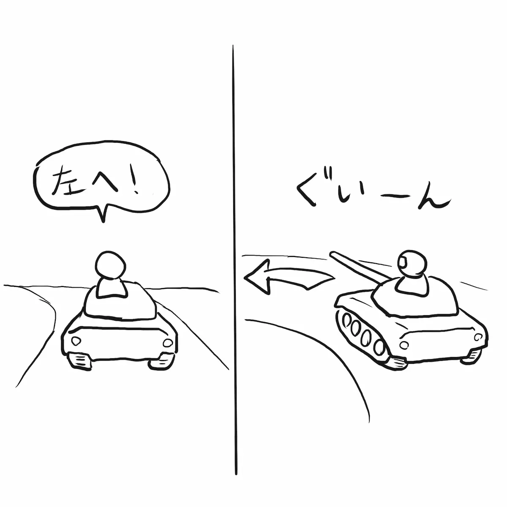

日本の皆さんこんちは。

いきなりですが、単車教練について軽く説明します。

ちなみにここでの単車とは「戦車」です。バイクではありません。

単車教練は車長 (Tank Commander) と操縦手 (Driver) 及び指導教官 (Instructor) の 3 人で行います。訓練対象は車長です。経験の浅い車長が単車 (戦車一両) を思い通りに動かせるようになるため必須の訓練です。さきに 3 人で行うと言いましたが、経験豊富な操縦手を当てがうことで車長と操縦手の 2 人のみで軽易に行うこともできます。

一連の流れを見てみましょう。

## 乗車します。

## 発車します。

「前進用意」

「前へ」

## 目的地に到着すべく操縦手を上手く導きます。

「右へ」

「左へ」

「速度増せ」等。

## 指揮のフィードバックは即座に帰ってきます。間違ったもの含めて。

「右へ」「うわあぁぁぁぁ…！」

訓練された操縦手がいながらなぜこんなことが起きるかというと、戦車の構造上、操縦手席からはほぼ前方くらいしか見えてないからです。

操縦手から見える世界

彼ら操縦手にとって左右後方の状況を知る術が車長の指示以外にないのです。40t をゆうに超える鉄の塊を操縦するのに前方しか見させてくれないというのは、よくよく考えてみると恐ろしいほど高い要求です。

だからこそ戦車はチョロっとその辺を動かすだけでも、操縦手の他に車長を必要とするのです。

この単車教練を通して、車長は操縦手の視界や特性を学び、操縦手は車長の指示やクセを学び、お互いの役割を理解することで単車を思い通りに動かすことができるようになります。

2 人仲良くね！

…

なんでいきなりこんな話をしたかと言うとね、これを今日、息子とやってみたの。（実は息子持ちなのです）パパは単車なんかではないので「肩車教練」とでも名付けようか。

## 肩車教練

---

- 車長: 👦🏻 息子、最近右と左がわかるようになってきた 4 歳児
- 操縦手: 😎 Kyoshin、元戦車小隊長、最近右と左がよくわからなくなってきた 45 歳プログラマー

---

さっそく見てみよー。

## まずは乗車します。

👦🏻 😎「乗車ー」

## 発車します。

👦🏻「前へ！」

## 右に進みます。

👦🏻「右へ！」

## 左に進みます。

👦🏻「左へ！」

## そこそこ順調に進みます。

😎「車長、上手ですね。」

👦🏻「えへへ〜」

## ときに間違えます。

👦🏻「右へ！」「あぁぁ左！左！」

## ときに障害にぶつかります。

👦🏻「前へ！前へ！前ーー 😡」

😎「車長、無茶言わんでください。」

## 経験豊富な操縦手は車長にアドバイスができます。

😎「車長、一旦後ろに下がってはどうでしょう？」

（うーん。）

👦🏻「後ろ！」

😎「車長、後ろ見てくれてます？私見えませんよ。」

👦🏻「うん。見てるよ〜」

## 過ちは繰り返されます。

👦🏻「前へ！」

👦🏻「あぁぁあ！パパ止まって！」

😎「車長、コマンドでお願いします。」

こんな調子で登り降りのあるハイキングコース 2 時間歩き回りました。もうパパ戦車はクタクタですよあんた。

最初のころに多くあった右と左の間違いも 1 時間もすると随分少なくなり、スムーズにパパを動かせるようになりました。

## 肩車教練の良い点

## タイトなフィードバックループ

肩車教練では、自らが発した言葉の結果がタイトに返ってきます。つまり誤ちを犯したことを即座に知ることができ、それと同時にそれが起こす影響を安全に体験することができるのです。前後左右にしか動けない世界という極端に簡略化された Sandbox のなかで問題を提起され、その解決策を考案して自らの道を切り開くという経験を危険にさらされることなく積むことができます。（そして「単車」は日頃の運動不足を解決することができます。）

別に難しいことをしているわけではありません。

なぜなら解決案は前、右、左、後ろの 4 つしかありません。それでも 4 歳児は自らの意思で解決策を考え、実行し、結果を受け入れることができるようになるのです。

また面白いことに Sandbox 化された世界に入り込みそこで問題を解決するという一連の行動や考え方は今日我々が行なっているプログラミングそのものなのです。どーでもいいけど。

というわけで、肩車のできるほど小さな子のいるお父さんはぜひ試してみましょう。コツはたとえ間違っているとわかってても子供のコマンドを尊重し愚直に実行することです、2 人そろって間違いを体験することが重要なのです。あくまで子供が主体でありであなたは単なる操縦手なのですから。

ただ本当に危険な時は「オーバーライド！」と叫んで修正、もしくは緊急停止してあげましょう。

そのうちうまく連携がとれてくると乗ってる方も担ぐ方も楽しくなります。いずれはお父さんの肩車は子供にとって戦車以上に頼もしいものになることでしょう。たぶん。

したっけ。
