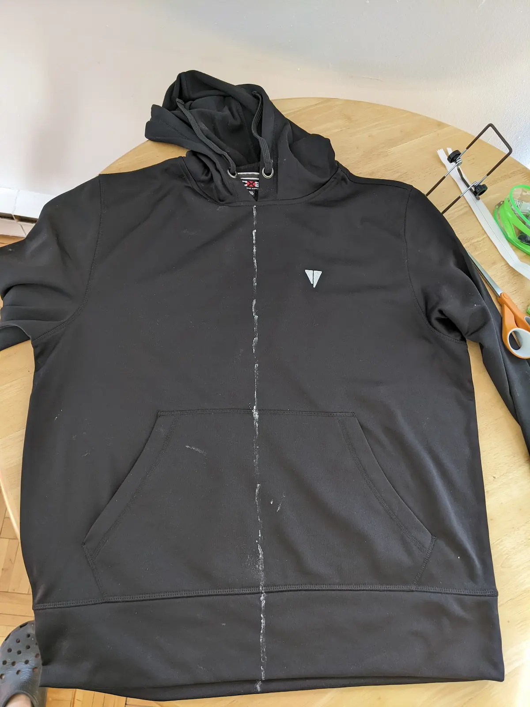
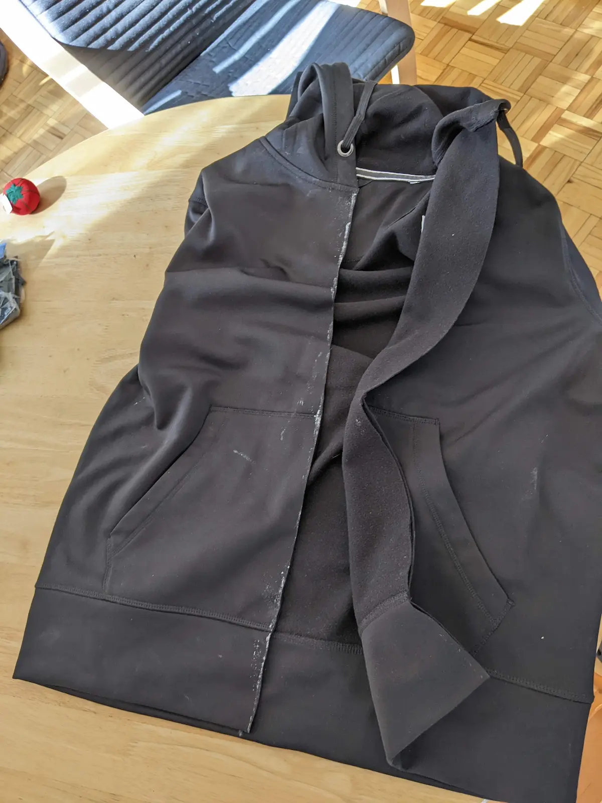
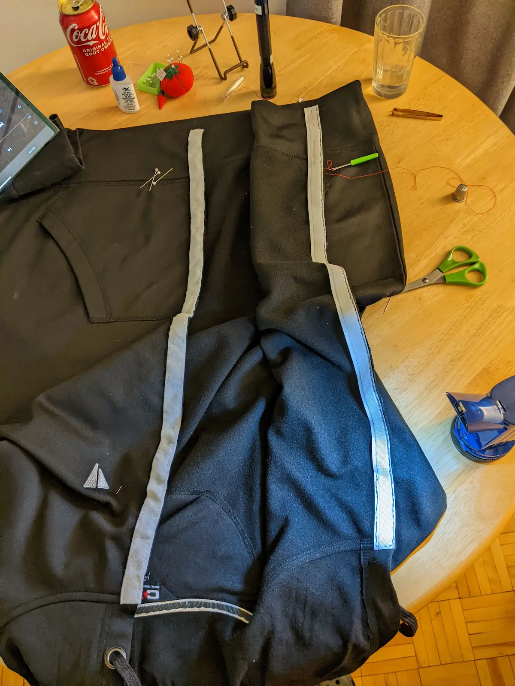
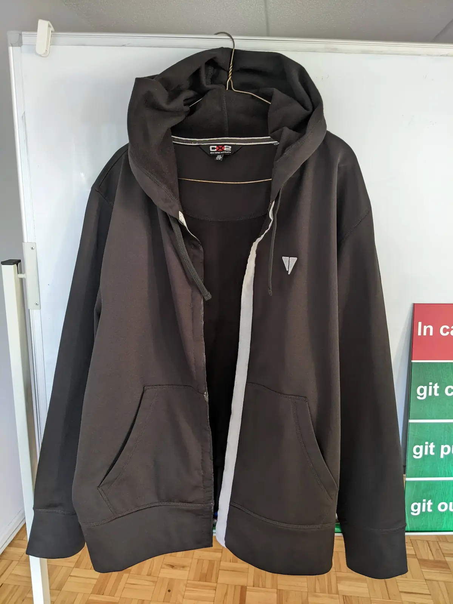
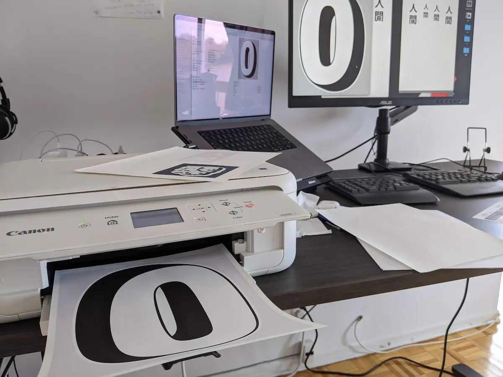
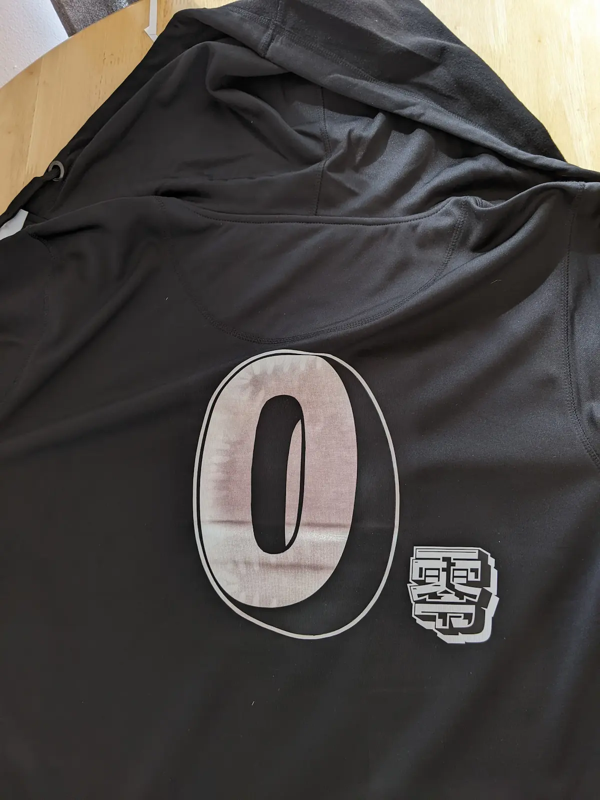
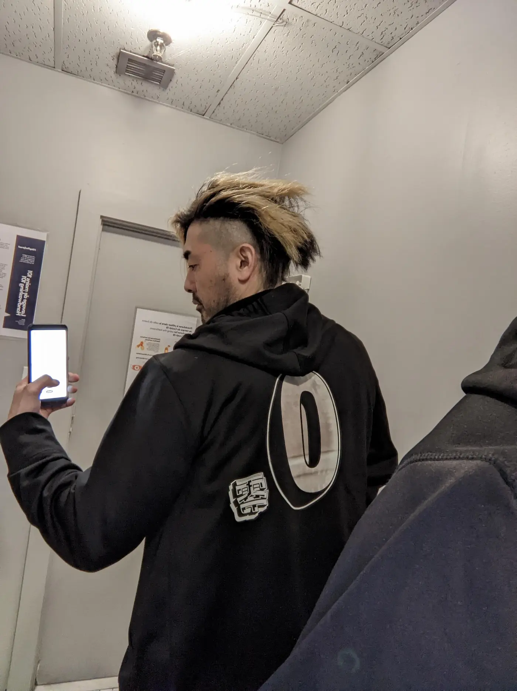

日本と北米大陸に住む皆さん久しぶり。🥳

最近さぁ、つっても半年経つんだけどさ、また転職したのよ。それまで Vancouver のスタートアップで働いててさ、 2 年ほど経ってたの気付いてなんとなく辞めたんだよ。そんで今度は地元のスタートアップに就職したの。それが去年の 9 月。

そう、またスタートアップ。地元モントリオール。しかも今回のは僕が最初の従業員だったりする。

## Swag

「スタートアップあるある」なんだけど、たいてい会社オリジナルのグッズ、例えばロゴの入った T シャツとかステッカーとか作って従業員に配ったりすんのよ。それを Swag って言うんだけど、日本語で言うと「お土産」みたいな感じかな。いや違うか。

滅多に服買わないから助かるんだよな。Vancouver の会社でも貰ったパーカー毎日着てたもん。文字通り毎日。

今の会社は最近まで Swag とかなかったからさ、前の会社から貰ったパーカー毎日着て出社してたんだよ。経営側からしたら、たった一人しかいない従業員が堂々と競合相手のロゴが入った服着て出社してくるんだよ「他に服ないから」とか言ってさ。今になって考えるとえらく失礼な男だね。ヨコハマタイヤにブリヂストンのロゴつけて出社してくるようなもんだよ。

それを 3 ヶ月ほど繰り返してたの。別に「作れ作れ」って無言のプレッシャー与えるためじゃないよ。

Swag しか着たくないんだよ。

## ある朝

ある朝、社長が朝早く出勤しててさ、なんだと思ったら僕のデスクの上にちょこんと新しいパーカーが綺麗にたたんで置いてあるじゃないの！

そんで社長が奥でニヤニヤしてるの！

これは…Swag だ！

「よかったら着てみてよ 😊」だって。そりゃあ着るさあ。

うちもついに作ったんだねぇ Swag。待ってたよ。ニヤニヤしちゃうわ。

## なんか違う 🤔

パーカーは黒でロゴもかっこいいしいいなぁと思ったんだけど、ちょっと小さいんだよね。いや、小さいって言うかジャストサイズ。

僕は 90 年代に育った男なのでゆったりとした服をダブダブっと着るのが好きなのよ。

ダブダブっと。

社長は「お、いいねぇ。ピッタリだねぇ 😊」って言ってくれたけど僕は

...ピッタリかあ 🤔 うーん。

サイズは L。カナダの L は普通にでかいからさ 186cm の僕でもちゃんと着れるんだけどなんかこう、ダブダブって感じじゃないのよ。わかる？

他の従業員は社長に感謝を伝えておごそかに持って帰っていってたんだけど（この頃には従業員も 5 人くらいまで増えてた）

僕は社長に「XL にしてください。僕はダブダブっとしたのがいいんです。」ってきちんと伝えて返したんですよ。

なんでこんなことするかって？

### 毎日着るからだよ。

黙って持って帰った人は着ないよきっと。普通の人は Swag なんて着ないもん。

…数週後

社長「新しいパーカー作ったぞ 😎 XL なら大丈夫だよね。」って。

今度はダブダブ 👍 ありがとよ社長。

しかしながら、しばらく着てると新たな不満が…

## 暑い

暑いねぇ。最近地球あったかくなってきたじゃん？モントリオールも同じ。

うちのパーカーはさ、フルにかぶって着るタイプのやつで暑い季節に着てるのちょっときついんだよね。前の会社のはジッパー付きだったから開けたままにしたり、ファサッとはおれたのよ。ふぁさぁーっと。

寒い季節に限らず毎日着たいんだけど困ったよね。さすがにこの段階で「ジッパー付きのにして」って突き返すほど狂っちゃいないのでそこは自分で改造することにした。craftsmanship の血が騒ぐぜ 🩸

## 改造するのは愛があるから。

パーカーをグレードアップ、改造することにしたのよ。真ん中を切ってジッパーを付けるの。そうすれば暑い季節にも着れるし、ダブダブっとした感じにもなるし。

幸い陸上自衛隊で名札を付けたりするために基本的な縫製の技術を学んできたからさ、こりゃ自分で出来るんじゃないかと思って。縫い物とアイロンがけは得意な方だもん。特にアイロンがけにはこだわりがあって薄い本が書けるくらい。3 ページくらいの。薄っ。

まいっか、やるぞー。

まずは指先に小麦粉をチョンと付けて真ん中にすぅっとラインを引きます。

ラインに沿ってジョキジョキっと切ります。この時点でもう戻れません。

そんで Fray Check という商品（衣服専用の接着剤みたいなもの）を切り口にペタペタ塗って糸などがほつれるのを防ぎます。

Zipper はあらかじめ用意していたのだが、なんと二つに分かれないタイプのものだったのが服を真っぷたつした後判明。😱 バカだねー。

念のため Velcro（マジックテープ）を用意してたのでそれで代替することにした。あぶねー。

改造はモチベーションが高いうちにやらないと。縫うぞー。

チクチク…

…ギャッ 🩸

チクチク…

陸自推奨のまつり縫いだ。久々なんで 2 時間以上かかったよ。指痛ぇ、ミシン欲っしい。だれか送ってちょうだい 🙏 ちゃんと使うから。

開始から 3 時間経過したところでなんとか完成。ロゴに合わせてベルクロを白にしたんだけどツートーンって感じで悪くないでしょう？あとは小麦粉をパパッと払えば切り口も綺麗になるかな。

うーん。

いい。

いいよ。（じんわり）

これで暑い季節にも着れるし、よりダブダブっとした感じにもなったわ。これで安心して仕事に行けるよ。

でもね…

🔥🔥🔥🔥 なんか火がついた 🔥🔥🔥🔥

オリジナルロゴもつけるか！急遽デザインする。

背中につけるロゴをデザイン・プリントアウトします。アイロンで衣服にプリントできる特殊な紙を使います。

あとはアイロンを熱くしてプリントアウトした紙を上からギューっと押し込むだけ。

そんで…

できた！ちょっとアイロンの温度高過ぎてゼロが赤みおびちゃったけど、こなれた感じが出てこれはこれで良いのでは？カナダで漢字は「よくわからんがクールな記号」と認識されてるので横に添えとく。

さっそく会社に着ていって自慢する。社長もちょっとびっくりしてた様子だったけどきっと内心では泣いて喜んでいることでしょう。ちなみにゼロは僕の従業員 ID。最初の従業員なので 0。背番号みたいで良いでしょう 😎

読んでくれてありがとね。

したっけ。
