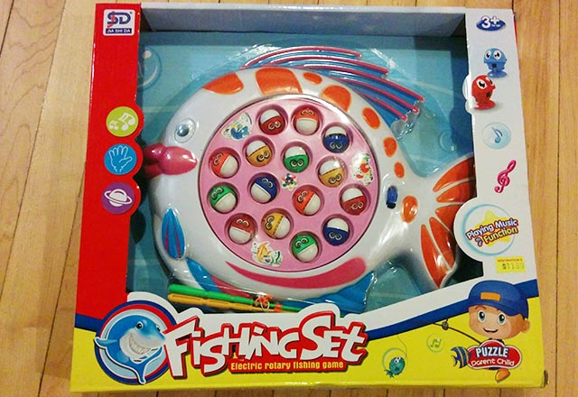

import { IFRAME } from 'src/components/constants'

「ぎぃ〜ガチャ、へチョッ」

さて、この音はなんでしょう？

「ぎぃ〜ガチャ、へチョッ」「ぎぃ〜ガチャ、へチョッ」…

勘の良い皆さんはそろそろおわかりですね？

機械化釣り堀を買いました。高いんだか安いんだかよくわかんない 11 ドル。レジで「カエルちゃんバージョンもあるんだよ。」とオヤジに言われたけど丁重に断った。カエルが釣りにかかるわけないじゃん。

  <iframe
    src='//www.youtube.com/embed/5EzOTKiFKSQ'
    width={IFRAME.WIDTH}
    height={IFRAME.HEIGHT}
    frameborder='0'
  ></iframe>

この機械化釣り堀も Virtual Reality

字余り。
