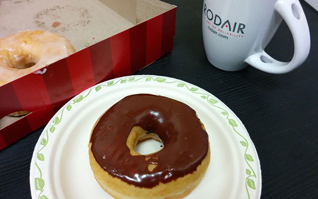

はー今日もなんとか仕事終わった。バス乗るぞー。
通勤で毎日使うバス。暖かくなると自転車で通勤する輩が増えるためだろうか、最近特に空席が目立つようになった。
珍しく窓際に座ってぼーっとモントリオールの街並みを眺める。空はまだまだ明るい。

今日はカナダでの労働環境について書こう。katakatakatakata...

## 労道王国 - 日本

今思えば日本に居た時の労働環境は酷かった。

5 時からやっと自分の仕事ができる、なんて普通に言われた職場。朝暗いうちに家を出て、帰宅する頃も当然真っ暗。季節を感じる余裕どころかそもそも月の感覚すら怪しい。
次々に追加される意味不明タスク、倒れる同僚、遵守すべきだが何故か明文化されてない暗黙のルール、飛び込んでくる服務事故、消える部下、上司へ説明の為だけに使われる謎資料の作成。検査準備。土日のうちどちらかは働こうね謎ルール。僕も一度ブッ壊れた。

そもそも、なんであんなに長く働かなけれならなかったのだろうか。
石の上にも三年なんて言葉があるが、日本での労働はまさに「労道」であった。

当時の同僚の一人は、時計が夜中の 12 時まわろうとしてたのでもう無理って帰ろとしたら「え、もう帰るの？」って上司に言われたらしい。冗談かと思ったが上司本人は大真面目だった。

もはや狂っている。

## 生産性王国 - カナダ

カナダ、いや少なくともここモントリオールの多くの会社では、朝に始まった仕事はきちんと 5 時に終わる。やりかけの仕事があろうがなかろうが帰宅しなけれならない。なぜなら会社自体締めちゃうんでねって事が多い。

現在、長時間労働環境が横行している職場で苦しんでいる人にとっては天国の様に映るであろうが、人によっては何も良い面ばかりとは言い切れない。

9-5 時の勤務時間が物凄く濃密なのである。

というのも一旦仕事が始まったら飯以外の時間はずっーと仕事しなきゃいけない。当たり前だろこの野郎と怒る前に想像して欲しい、8 時間ずぅーっと自分正面の仕事以外をやる機会が全くもって存在しないっていうのは結構な負担だ。
日本育ちの僕にとってはかつて経験したことのない程の濃厚な勤務時間。当初は脳がトロトロ溶けて耳から流れ出ちゃうぐらいの衝撃だった。

生産性を上げるためとはいえ、昼食時以外 8 時間ぶっ続けで画面を見続ける日なんてのはザラ。僕の右隣りに座るカナダ人の同僚は、デスクでパソコン叩きながら昼食を摂る超絶ハードコア野郎なんでもはや休憩無し。文字通り 9 時から 5 時まで画面見っぱなし。
本人は休憩してると言うが、さすがに僕はこれできない。

中にはタバコ休憩する人も 1 人いるが、1 日に数本吸うだけでこっちが心配になるくらいずっとデスクにかじりついてる。
もっと吸ってもいいんだよ…。

別に我が社はワーカホリックの従業員ばかりを集めたわけでもない。
皆目的があるからこんなことができるのだ。

5 時の定時 - ゴールが見えるから頑張れる
こっちじゃゴールが明確に線引きされている。

5 時だ。

誰しも定時である 5 時に帰るために必死なのである。

経験あると思うが、集中してやってたら 9-5 時なんてあっという間。それでも僕らは夕方の 5 時までにある一定の成果を出さなきゃならない。それが続けて出来ない人達は順番に消えていく…。
残業が無い一方で、こういった現実があるのだ。

それに思うのだが、きっちり集中して仕事するなら 5 時までが人間の限界、頑張って 6 時だろう。それ以上長く働ける人はスーパーマンか仕事中にフリーセルやってる人だ。
まぁそうは言っても、帰宅が夜の 10-11 時って思ってれば無意識に仕事の密度も落としちゃうよな。人間、はっきり見えないゴールに向かって全力疾走なんてできないのだ。

僕はウェブデザイナーである現在の職に就いてようやく 4 ヶ月が経過した。
自分の好きなことで飯食ってるのだから随分と幸せな境遇だと自覚しているのだが、なんせこれまで就いてきた業界（軍/セキュリティ）と 180 度違う分野なもんで、37 歳にして毎日が勉強なんだな、これが。

日本みたいに、夜遅くまで一人粘って成果を出すっていうオプションはここでは使えないし。そもそも反則だし…。

そう思うと日本のような（100 歩譲って言おう）"柔軟性のある" 労働環境は、修行中の身である僕には時々羨ましく映るのだった。

ごめん嘘ついた。

カナダ最高。

仕事しながら食らうドーナツとコーヒーの組み合わせは最高だ。太るやもしれぬ。

読んでくれてありがとう。

したっけ。
